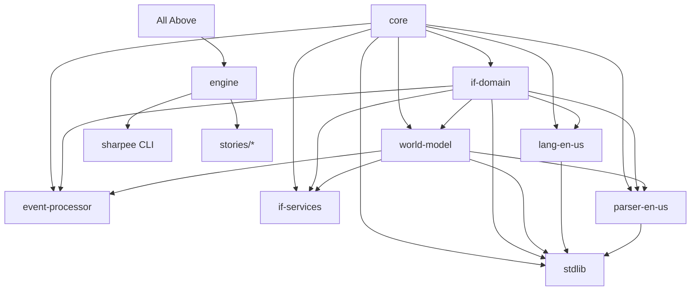

# Deep Architecture Analysis - Sharpee Platform

## Table of Contents
1. [Dependency Architecture](#dependency-architecture)
2. [Data Flow Architecture](#data-flow-architecture)
3. [Design Patterns Analysis](#design-patterns-analysis)
4. [State Management Architecture](#state-management-architecture)
5. [Event Architecture](#event-architecture)
6. [Runtime Architecture](#runtime-architecture)
7. [Architectural Debt Analysis](#architectural-debt-analysis)
8. [Security Architecture](#security-architecture)
9. [Performance Architecture](#performance-architecture)
10. [Recommendations](#recommendations)

---

## 1. Dependency Architecture

### 1.1 Package Dependency Graph



### 1.2 Coupling Analysis

#### Afferent Coupling (Ca) - Dependencies on this package
- **core**: 12 packages depend on it (highest)
- **if-domain**: 9 packages
- **world-model**: 7 packages
- **engine**: 2 packages (stories, CLI)

#### Efferent Coupling (Ce) - Dependencies of this package
- **engine**: 9 dependencies (highest - orchestrator)
- **stdlib**: 4 dependencies
- **sharpee**: 8 dependencies (CLI aggregator)
- **core**: 0 dependencies (foundation)

#### Instability Index (I = Ce/(Ca+Ce))
- **core**: 0.0 (maximally stable - good for foundation)
- **engine**: 0.82 (highly unstable - appropriate for orchestrator)
- **stdlib**: 0.31 (moderately stable - concerning for library)
- **world-model**: 0.22 (stable - good for domain model)

### 1.3 Circular Dependencies Detected

```typescript
// CRITICAL ISSUE: Circular dependency chain
stdlib -> world-model -> stdlib (through type imports)
parser-en-us -> world-model -> parser-en-us (through interfaces)
```

### 1.4 Package Responsibilities

| Package | Single Responsibility? | Cohesion | Issues |
|---------|----------------------|----------|---------|
| core | ✅ Types & interfaces | High | None |
| world-model | ❌ Too many responsibilities | Medium | Handles entities, traits, scope, state |
| engine | ⚠️ Orchestration + execution | Medium | Mixes concerns |
| stdlib | ❌ Actions + validators + helpers | Low | Should be split |
| parser-en-us | ✅ Parsing only | High | Clean |
| event-processor | ✅ Event handling | High | Clean |

---

## 2. Data Flow Architecture

### 2.1 Command Processing Pipeline

```typescript
// Current data flow (simplified)
Input -> Parser -> Validator -> Resolver -> Action -> Events -> Output

// Detailed flow with data transformations
1. Raw Input (string)
   ↓ Parser.parse()
2. ParsedCommand { verb, objects, prepositions }
   ↓ CommandValidator.validate()
3. ValidatedCommand { action, entities, context }
   ↓ ScopeResolver.resolve()
4. ResolvedCommand { action, resolvedEntities }
   ↓ Action.execute()
5. SemanticEvent[] { type, data, timestamp }
   ↓ EventProcessor.process()
6. ProcessedEvents[] { events, sideEffects }
   ↓ TextService.format()
7. Output (string)
```

### 2.2 Data Transformation Issues

#### Type Erosion
```typescript
// Problem: Loss of type information through pipeline
ParsedCommand (strongly typed) 
  -> any (in action execute) 
  -> SemanticEvent (weakly typed data: any)
```

#### Data Duplication
```typescript
// Same entity data exists in multiple places
entity.attributes.name // In entity
entity.traits.get('identity').name // In trait
context.directObject.name // In command context
event.data.objectName // In event
```

### 2.3 Data Ownership Confusion

| Data Type | Owner | Also Modified By | Issues |
|-----------|-------|------------------|---------|
| Entity state | WorldModel | Actions, Traits, Story | No single source of truth |
| Game state | Story | WorldModel, Engine | Unclear boundaries |
| Turn state | Engine | Actions, EventProcessor | Scattered updates |
| Player state | WorldModel | Actions, Story | Mixed responsibilities |

---

## 3. Design Patterns Analysis

### 3.1 Patterns Identified

#### Entity-Component-System (ECS) Pattern
```typescript
// Partially implemented with Entity-Trait system
class IFEntity {
  traits: Map<TraitType, Trait>; // Components
}

// ISSUE: Missing System layer - logic scattered in traits/actions
```

#### Command Pattern
```typescript
// Well implemented for actions
interface Action {
  id: string;
  validate(context): ValidationResult;
  execute(context): SemanticEvent[];
}

// GOOD: Encapsulates requests as objects
```

#### Observer Pattern
```typescript
// Attempted with event handlers
entity.on = {
  'if.event.pushed': (event) => SemanticEvent[]
}

// ISSUE: Inconsistent - some use events, some direct manipulation
```

#### Strategy Pattern
```typescript
// Used for text services
interface TextService {
  formatEvent(event): string;
}

// GOOD: Swappable formatting strategies
```

### 3.2 Anti-Patterns Detected

#### God Object
```typescript
class WorldModel {
  // 50+ methods, manages:
  - Entity creation/deletion
  - Trait management
  - Scope/visibility
  - State persistence
  - Event handling
  - Relationship management
  // VIOLATION: Single Responsibility Principle
}
```

#### Anemic Domain Model
```typescript
class IFEntity {
  // Mostly data, little behavior
  attributes: Record<string, any>;
  traits: Map<TraitType, Trait>;
  // Logic in external services instead of entity
}
```

#### Service Locator
```typescript
// Hidden dependencies through context object
execute(context: ActionContext) {
  context.world // Hidden dependency
  context.parser // Hidden dependency
  context.language // Hidden dependency
}
```

### 3.3 Missing Patterns

#### Repository Pattern
```typescript
// Should have:
interface EntityRepository {
  find(id: string): IFEntity;
  findByType(type: string): IFEntity[];
  save(entity: IFEntity): void;
}
// Currently: Direct WorldModel access everywhere
```

#### Unit of Work
```typescript
// Should track changes and commit atomically
// Currently: Immediate mutations without transaction support
```

#### Specification Pattern
```typescript
// Should have for complex entity queries
interface Specification<T> {
  isSatisfiedBy(candidate: T): boolean;
  and(other: Specification<T>): Specification<T>;
}
// Currently: Ad-hoc filtering logic
```

---

## 4. State Management Architecture

### 4.1 State Distribution

```typescript
// State is scattered across multiple locations

// 1. WorldModel state
class WorldModel {
  private entities: Map<EntityId, IFEntity>;
  private state: StateFrame;
  private scopeRules: ScopeRule[];
}

// 2. Entity state
class IFEntity {
  attributes: Record<string, any>; // Mutable
  relationships: Record<string, EntityId[]>; // Mutable
  traits: Map<TraitType, Trait>; // Traits have state
}

// 3. Trait state
class ContainerTrait {
  capacity: { maxItems: number };
  contents: EntityId[]; // Duplicate of WorldModel relationships
}

// 4. Story state
class Story {
  private customState: any; // Untyped story-specific state
}

// 5. Engine state
class GameEngine {
  private turnCount: number;
  private history: Command[];
}
```

### 4.2 State Mutation Patterns

#### Direct Mutation (Anti-pattern)
```typescript
// Found throughout codebase
entity.attributes.name = 'new name'; // Direct mutation
trait.isOpen = true; // Direct property change
world.entities.set(id, entity); // Direct map manipulation
```

#### No State Immutability
```typescript
// Should use:
const newState = {
  ...oldState,
  entities: new Map([...oldState.entities, [id, entity]])
};

// Currently: Mutates in place
```

### 4.3 State Synchronization Issues

```typescript
// Problem: Multiple sources of truth
entity.location // Entity thinks it's here
world.getLocation(entity.id) // World thinks it's there
container.contents.includes(entity.id) // Container thinks it has it

// No mechanism to ensure consistency
```

---

## 5. Event Architecture

### 5.1 Event Flow Analysis

```typescript
// Current event flow has multiple paths

// Path 1: Action -> Events -> EventProcessor
Action.execute() 
  -> SemanticEvent[]
  -> EventProcessor.process()
  -> TextService.format()

// Path 2: Entity handlers (new)
Entity.on['event.type']()
  -> SemanticEvent[]
  -> ??? (unclear processing)

// Path 3: Story handlers
Story.on('event.type')
  -> SemanticEvent[]
  -> ??? (unclear integration)
```

### 5.2 Event Type Hierarchy

```typescript
// Current: Flat event structure
interface SemanticEvent {
  id: string;
  type: string; // Magic string
  data: any; // Untyped payload
  timestamp: number;
  entities: Record<string, IFEntity>;
}

// Should have: Typed event hierarchy
abstract class GameEvent<T = unknown> {
  abstract readonly type: string;
  abstract readonly data: T;
}

class ObjectMovedEvent extends GameEvent<{
  objectId: string;
  fromLocation: string;
  toLocation: string;
}> {
  readonly type = 'if.event.object_moved';
}
```

### 5.3 Event Processing Gaps

| Issue | Current State | Impact |
|-------|--------------|---------|
| No event bus | Events processed inline | Can't intercept/monitor |
| No event replay | Events are fire-and-forget | Can't implement undo |
| No event sourcing | State derived from mutations | Can't rebuild state |
| No event priorities | All events equal | Can't handle interrupts |
| No event cancellation | All events process | Can't prevent actions |

---

## 6. Runtime Architecture

### 6.1 Initialization Sequence

```typescript
// Complex, tightly coupled initialization
1. Create WorldModel
2. Create Parser (depends on world)
3. Create LanguageProvider (depends on parser)
4. Load StdLib (depends on all above)
5. Create EventProcessor (depends on world)
6. Create Engine (depends on all above)
7. Load Story (modifies everything)
8. Initialize Story (more modifications)

// Problem: Can't partially initialize for testing
```

### 6.2 Memory Architecture

```typescript
// Everything loaded eagerly
class StdLib {
  private actions: Map<string, Action> = new Map([
    // ALL 40+ actions loaded immediately
  ]);
}

// Should lazy-load:
class StdLib {
  private getAction(id: string): Action {
    return this.loadAction(id); // Load on demand
  }
}
```

### 6.3 Processing Architecture

#### Single-threaded Blocking
```typescript
// All processing is synchronous and blocking
execute(input: string): string {
  const parsed = this.parser.parse(input); // Blocks
  const validated = this.validator.validate(parsed); // Blocks
  const events = this.action.execute(validated); // Blocks
  const processed = this.processor.process(events); // Blocks
  return this.formatter.format(processed); // Blocks
}

// No async support for:
- Network operations
- File I/O
- Expensive computations
```

---

## 7. Architectural Debt Analysis

### 7.1 Technical Debt Inventory

| Debt Type | Location | Severity | Estimated Fix |
|-----------|----------|----------|---------------|
| Type safety violations | Actions (any types) | HIGH | 2 weeks |
| Circular dependencies | stdlib <-> world-model | HIGH | 1 week |
| God object | WorldModel | MEDIUM | 3 weeks |
| Missing abstractions | No repository/UoW | MEDIUM | 2 weeks |
| Inconsistent patterns | Behaviors vs Handlers | HIGH | 2 weeks |
| No dependency injection | Hard-coded deps | MEDIUM | 3 weeks |
| No error boundaries | Errors bubble up | HIGH | 1 week |
| No validation layer | Validation scattered | MEDIUM | 2 weeks |

### 7.2 Architectural Smells

#### Rigidity
- Hard to change one thing without changing many
- Example: Adding new trait requires changes in 5+ packages

#### Fragility
- Changes break unrelated parts
- Example: Modifying WorldModel breaks stories

#### Immobility
- Can't reuse components independently
- Example: Can't use parser without entire world-model

#### Viscosity
- Easier to do wrong thing than right thing
- Example: Easier to add 'any' than proper types

#### Needless Complexity
- Over-engineering in some areas
- Example: Event system for simple state changes

#### Needless Repetition
- Same patterns copied instead of abstracted
- Example: Every action has similar validation code

#### Opacity
- Hard to understand intent
- Example: Unclear why both behaviors and handlers exist

---

## 8. Security Architecture

### 8.1 Input Validation

```typescript
// ISSUE: No sanitization of user input
parse(input: string) {
  // Directly processes raw input
  return this.tokenize(input); // No validation
}

// Should have:
parse(input: string) {
  const sanitized = this.sanitize(input); // Remove dangerous chars
  const validated = this.validate(sanitized); // Check length/format
  return this.tokenize(validated);
}
```

### 8.2 State Access Control

```typescript
// ISSUE: No access control on state modifications
world.moveEntity(entityId, locationId); // Anyone can move anything

// Should have role/permission checks:
world.moveEntity(entityId, locationId, actor) {
  if (!this.canMove(actor, entityId)) {
    throw new PermissionError();
  }
}
```

### 8.3 Script Injection Risks

```typescript
// ISSUE: Dynamic code execution possibilities
eval(storyCode); // If stories can inject code
new Function(actionCode)(); // If actions are dynamic

// Entity names could contain malicious content
entity.name = "<script>alert('XSS')</script>"; // Not sanitized
```

---

## 9. Performance Architecture

### 9.1 Computational Complexity

| Operation | Current | Optimal | Impact |
|-----------|---------|---------|---------|
| Scope calculation | O(n²) | O(n) | Slow with many entities |
| Entity lookup | O(n) | O(1) | Should use indexes |
| Pattern matching | O(n*m) | O(n) | Parser inefficiency |
| Event processing | O(n²) | O(n) | Nested iterations |

### 9.2 Memory Patterns

```typescript
// Memory leaks potential
class WorldModel {
  private entities = new Map(); // Never cleaned up
  private eventHistory = []; // Grows forever
  
  // No memory management:
  // - No entity pooling
  // - No event cleanup
  // - No cache expiration
}
```

### 9.3 Caching Strategy

```typescript
// No caching currently implemented

// Should have:
class CachedScopeResolver {
  private cache = new Map<string, Scope>();
  
  resolve(context: Context): Scope {
    const key = this.getCacheKey(context);
    if (this.cache.has(key)) {
      return this.cache.get(key);
    }
    const scope = this.calculateScope(context);
    this.cache.set(key, scope);
    return scope;
  }
}
```

---

## 10. Recommendations

### 10.1 Immediate Refactoring (Critical)

#### 1. Break Circular Dependencies
```typescript
// Create interface packages
@sharpee/interfaces
  - IParser
  - IWorldModel
  - IAction

// Depend on interfaces, not implementations
```

#### 2. Split WorldModel Responsibilities
```typescript
// Separate into focused services
EntityRepository - Entity CRUD
TraitManager - Trait operations
ScopeCalculator - Visibility logic
StateManager - State persistence
RelationshipManager - Entity relationships
```

#### 3. Introduce Dependency Injection
```typescript
// Use DI container
class GameEngine {
  constructor(
    private container: DIContainer
  ) {
    this.world = container.get<WorldModel>('WorldModel');
    this.parser = container.get<Parser>('Parser');
  }
}
```

### 10.2 Short-term Architecture Improvements

#### 4. Implement Event Bus
```typescript
class EventBus {
  private handlers = new Map<string, Handler[]>();
  
  emit(event: GameEvent): void {
    const handlers = this.handlers.get(event.type) || [];
    for (const handler of handlers) {
      handler(event);
    }
  }
  
  on(type: string, handler: Handler): void {
    // Register handler
  }
}
```

#### 5. Add State Management Layer
```typescript
class StateManager {
  private state: GameState;
  private history: StateChange[];
  
  dispatch(action: StateAction): void {
    const newState = this.reducer(this.state, action);
    this.history.push({ from: this.state, to: newState });
    this.state = newState;
  }
  
  undo(): void {
    // Revert to previous state
  }
}
```

#### 6. Type-safe Event System
```typescript
// Define event types
type EventMap = {
  'object.moved': ObjectMovedEvent;
  'door.opened': DoorOpenedEvent;
  'game.won': GameWonEvent;
};

// Type-safe emitter
class TypedEventEmitter<T extends EventMap> {
  emit<K extends keyof T>(type: K, data: T[K]): void;
  on<K extends keyof T>(type: K, handler: (data: T[K]) => void): void;
}
```

### 10.3 Long-term Architecture Vision

#### 7. Microkernel Architecture
```typescript
// Core kernel with minimal functionality
class Kernel {
  private plugins: Plugin[] = [];
  
  load(plugin: Plugin): void {
    plugin.initialize(this);
    this.plugins.push(plugin);
  }
}

// Everything else as plugins
class StdLibPlugin implements Plugin {}
class ParserPlugin implements Plugin {}
```

#### 8. CQRS Pattern
```typescript
// Separate read and write models
class CommandHandler {
  handle(command: Command): void {
    // Modify state
  }
}

class QueryHandler {
  handle(query: Query): Result {
    // Read state (optimized for queries)
  }
}
```

#### 9. Actor Model for Concurrency
```typescript
// Each entity as an actor
class EntityActor {
  private mailbox: Message[] = [];
  
  receive(message: Message): void {
    // Process message asynchronously
  }
}
```

### 10.4 Architecture Governance

#### Establish Architecture Decision Records (ADRs)
- Document all major decisions
- Include context, decision, consequences
- Review quarterly

#### Define Architecture Fitness Functions
```typescript
// Automated architecture tests
test('No circular dependencies', () => {
  const deps = analyzeDependencies();
  expect(deps.circular).toHaveLength(0);
});

test('WorldModel has < 20 methods', () => {
  const methods = getMethods(WorldModel);
  expect(methods.length).toBeLessThan(20);
});
```

#### Create Architecture Review Board
- Weekly architecture reviews
- Approve major changes
- Maintain architecture backlog

---

## Conclusion

The Sharpee architecture shows signs of organic growth without sufficient architectural governance. While the foundation is sound, significant refactoring is needed to address:

1. **Coupling issues** - Circular dependencies and tight coupling
2. **Responsibility confusion** - God objects and mixed concerns
3. **Type safety gaps** - Excessive use of 'any'
4. **Pattern inconsistency** - Multiple patterns for same problem
5. **Performance concerns** - No optimization or caching

The recommended approach is:
1. **Stabilize** - Fix critical issues (circular deps, type safety)
2. **Modularize** - Break apart monolithic components
3. **Standardize** - Pick and enforce patterns
4. **Optimize** - Add caching and performance improvements
5. **Scale** - Prepare for larger games and more features

Estimated effort: 3-4 months for full architectural renovation.

---

*Analysis Date: 2025-08-13*
*Next Review: 2025-09-13*