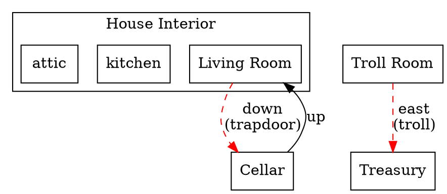

# ADR-115: Map Export CLI

## Status: Proposed

## Supersedes: ADR-113 (Map Position Hints)

ADR-113 proposed building a visual map editor for Sharpee. This ADR takes a different approach: instead of competing with established tools like Trizbort, Sharpee provides a CLI tool that exports rich map data for consumption by external mapping tools.

## Context

Interactive Fiction has well-established mapping tools (Trizbort, IFMapper, etc.) that authors already know and use. Building a Sharpee-specific map editor would:

1. Duplicate existing functionality
2. Require authors to learn a new tool
3. Compete in a space with entrenched solutions

However, existing tools lack awareness of Sharpee's game semantics. They can visualize room connections but don't understand:

- Blocked exits (locked doors, guardian NPCs, darkness)
- Conditional connections (one-way passages, requires item)
- Dynamic state (connections that change during play)

A CLI tool that extracts this semantic information and exports it in consumable formats would complement existing tools rather than compete with them.

## Decision

Create a CLI command that analyzes a Sharpee story and exports structured map data including blocking conditions and connection semantics.

### Command Interface

```bash
# Export to JSON (default)
sharpee map-export --story dungeo --output map.json

# Export to Trizbort format
sharpee map-export --story dungeo --format trizbort --output map.trizbort

# Export to GraphViz DOT
sharpee map-export --story dungeo --format dot --output map.dot

# Export to YAML
sharpee map-export --story dungeo --format yaml --output map.yaml

# Include only specific regions
sharpee map-export --story dungeo --regions surface,underground

# Show blocking conditions in verbose mode
sharpee map-export --story dungeo --verbose
```

### Declarative Connection Metadata

For the CLI to understand blocking conditions, the platform needs declarative metadata on connections. Currently, blocking logic lives in imperative action validation code that can't be statically analyzed.

#### Enhanced Connection API

Extend `world.setConnection()` to accept blocking metadata:

```typescript
// Simple connection (no blocking)
world.setConnection(kitchen, 'west', livingRoom);

// Connection blocked by door state
world.setConnection(cellar, 'up', livingRoom, {
  blockedBy: trapdoorId,
  condition: 'closed',  // Blocked when trapdoor.isOpen === false
  description: 'The trapdoor is closed.'
});

// Connection blocked by NPC
world.setConnection(trollRoom, 'east', treasury, {
  blockedBy: trollId,
  condition: 'alive',   // Blocked while troll is alive
  description: 'A troll blocks the way.'
});

// Connection requiring item
world.setConnection(darkCave, 'north', deepCave, {
  requires: { light: true },
  description: 'It is too dark to go that way.'
});

// One-way connection
world.setConnection(cliff, 'down', ravine, {
  oneWay: true,
  description: 'You slide down. There is no way back up.'
});

// Conditional connection (appears only after event)
world.setConnection(altar, 'down', crypt, {
  appearsWhen: { flag: 'crypt-revealed' },
  description: 'Stone stairs lead down into darkness.'
});
```

#### Connection Schema

```typescript
interface ConnectionMetadata {
  // Blocking conditions
  blockedBy?: string;           // Entity ID that blocks passage
  condition?: 'closed' | 'locked' | 'alive' | 'present' | string;

  // Requirements
  requires?: {
    light?: boolean;            // Requires light source
    item?: string;              // Requires specific item
    flag?: string;              // Requires story flag
  };

  // Connection properties
  oneWay?: boolean;             // Cannot return via opposite direction
  appearsWhen?: {               // Connection only exists when condition met
    flag?: string;
    entityState?: { id: string; property: string; value: any };
  };

  // Documentation
  description?: string;         // Shown when blocked
  notes?: string;               // Author notes (not shown to player)
}
```

#### Trait-Based Blocking

For NPCs and complex blocking scenarios, traits can declare what they block:

```typescript
// GuardianTrait enhancement
interface GuardianTrait extends ITrait {
  type: 'if.trait.guardian';

  // Existing
  allowedEntities?: string[];

  // New: declarative blocking info
  blocks?: Array<{
    from: string;        // Room ID
    direction: string;   // Exit direction
    until: 'defeated' | 'bribed' | 'distracted' | string;
  }>;
}

// Usage in story
troll.addTrait(GuardianTrait, {
  blocks: [
    { from: 'troll-room', direction: 'east', until: 'defeated' }
  ]
});
```

### Export Format: JSON

The canonical export format provides full semantic information:

```json
{
  "version": 1,
  "story": "dungeo",
  "exportedAt": "2026-01-24T20:45:00Z",
  "rooms": [
    {
      "id": "living-room",
      "name": "Living Room",
      "region": "house-interior",
      "description": "You are in the living room...",
      "exits": {
        "down": {
          "destination": "cellar",
          "blockedBy": {
            "entity": "trapdoor",
            "condition": "closed",
            "description": "The trapdoor is closed."
          }
        },
        "west": {
          "destination": "kitchen"
        }
      }
    },
    {
      "id": "troll-room",
      "name": "Troll Room",
      "region": "underground",
      "exits": {
        "east": {
          "destination": "treasury",
          "blockedBy": {
            "entity": "troll",
            "condition": "alive",
            "description": "A troll blocks the way."
          }
        }
      }
    }
  ],
  "entities": [
    {
      "id": "trapdoor",
      "name": "trapdoor",
      "type": "door",
      "initialState": { "isOpen": false }
    },
    {
      "id": "troll",
      "name": "troll",
      "type": "npc",
      "initialState": { "alive": true }
    }
  ],
  "regions": [
    {
      "id": "house-interior",
      "name": "House Interior",
      "rooms": ["living-room", "kitchen", "attic"]
    }
  ]
}
```

### Export Format: Trizbort

Trizbort uses an XML format. The exporter maps Sharpee data to Trizbort elements:

```xml
<?xml version="1.0" encoding="utf-8"?>
<trizbort version="1.7.0">
  <map>
    <room id="1" name="Living Room" x="0" y="0">
      <objects>trapdoor (closed)</objects>
    </room>
    <room id="2" name="Cellar" x="0" y="96">
    </room>
    <line id="1">
      <dock index="0" id="1" port="s" />
      <dock index="1" id="2" port="n" />
      <!-- Blocked indicator -->
      <style type="dashed" color="#ff0000" />
      <label>trapdoor (closed)</label>
    </line>
  </map>
</trizbort>
```

Trizbort styling conventions:
- **Dashed red lines**: Blocked connections
- **Dotted lines**: Conditional/hidden connections
- **Arrows**: One-way connections
- **Labels**: Blocking entity/condition

### Export Format: GraphViz DOT

For quick visualization without external tools:



### Runtime Introspection Mode

For stories with complex blocking logic that isn't fully declarative, the CLI can run the story in introspection mode:

```bash
sharpee map-export --story dungeo --mode introspect
```

This:
1. Loads and initializes the story world
2. Iterates all rooms
3. For each exit, queries: "Can the player go this direction? If not, why?"
4. Captures initial blocking state

The introspection engine calls into the going action's validate phase to determine blockages, then extracts semantic information from validation failures.

```typescript
interface IntrospectionResult {
  canPass: boolean;
  blockedBy?: {
    entityId: string;
    entityName: string;
    reason: string;        // Validation failure message ID
    condition?: string;    // Inferred condition
  };
}
```

### CLI Implementation

The map-export command lives in the CLI bundle:

```
packages/cli/
├── src/
│   ├── commands/
│   │   ├── map-export/
│   │   │   ├── index.ts           # Command entry point
│   │   │   ├── analyzer.ts        # Static analysis of story source
│   │   │   ├── introspector.ts    # Runtime introspection
│   │   │   ├── formatters/
│   │   │   │   ├── json.ts
│   │   │   │   ├── trizbort.ts
│   │   │   │   ├── dot.ts
│   │   │   │   └── yaml.ts
│   │   │   └── types.ts
```

## Implementation Phases

### Phase 1: Declarative Connection Metadata

1. Extend `IConnection` interface with `ConnectionMetadata`
2. Update `world.setConnection()` to accept metadata
3. Store metadata in world model, accessible via `world.getConnectionMetadata()`
4. Update going action to use metadata for validation messages

### Phase 2: Basic JSON Export

1. Create `map-export` CLI command
2. Implement story loader (reuse from transcript tester)
3. Walk all rooms and connections after world init
4. Export to JSON format with blocking info from metadata

### Phase 3: External Format Support

1. Trizbort XML exporter
2. GraphViz DOT exporter
3. YAML exporter
4. Format auto-detection from file extension

### Phase 4: Runtime Introspection

1. Introspection engine that queries going action
2. Semantic extraction from validation failures
3. Merge introspected data with declarative metadata
4. Handle dynamic/stateful blocking conditions

### Phase 5: Advanced Features

1. Region filtering (`--regions`)
2. Diff mode (compare against previous export)
3. Watch mode (re-export on file changes)
4. Integration with build.sh

## Consequences

### Positive

- Complements existing tools (Trizbort, IFMapper) rather than competing
- Authors use familiar mapping tools with richer data
- Blocking conditions visible in map visualization
- Encourages declarative connection design (better than imperative validation)
- CLI approach fits Sharpee's tooling philosophy
- Multiple output formats serve different use cases

### Negative

- Requires platform changes to support declarative metadata
- Existing stories need updates to provide blocking info
- Introspection mode adds complexity
- Trizbort format may not support all Sharpee semantics

### Neutral

- Stories without metadata still export (just without blocking info)
- Blocking visualization depends on external tool support
- Authors can ignore this if they don't use mapping tools

## Alternatives Considered

### Build a Visual Map Editor (ADR-113)

Rejected because:
- Competes with established tools (Trizbort)
- Significant development effort
- Authors must learn new tool
- Ongoing maintenance burden

### Trizbort Plugin

Build a Trizbort plugin that understands Sharpee. Rejected because:
- Trizbort is Windows/.NET only
- Plugin development in unfamiliar ecosystem
- Tight coupling to specific tool version

### No Map Tooling

Leave mapping to authors. Rejected because:
- Misses opportunity for differentiation
- Blocking conditions are valuable semantic data
- CLI export is relatively low effort

## References

- Trizbort: https://trizbort.io/
- GraphViz DOT language: https://graphviz.org/doc/info/lang.html
- Going action: `packages/stdlib/src/actions/standard/going/`
- Connection handling: `packages/world-model/src/services/connection-service.ts`
