# Sharpee Package Architecture

Generated: 2026-02-03

## Dependency Diagram

```mermaid
flowchart TB
    subgraph Foundation["Foundation Layer"]
        core["@sharpee/core"]
        text-blocks["@sharpee/text-blocks"]
    end

    subgraph Domain["Domain Layer"]
        if-domain["@sharpee/if-domain"]
        world-model["@sharpee/world-model"]
    end

    subgraph Services["Service Layer"]
        if-services["@sharpee/if-services"]
        text-service["@sharpee/text-service"]
    end

    subgraph Language["Language & Parser Layer"]
        lang-en-us["@sharpee/lang-en-us"]
        parser-en-us["@sharpee/parser-en-us"]
    end

    subgraph Engine["Engine Layer"]
        event-processor["@sharpee/event-processor"]
        plugins["@sharpee/plugins"]
        stdlib["@sharpee/stdlib"]
        engine["@sharpee/engine"]
    end

    subgraph Plugins["Plugin Layer"]
        plugin-npc["@sharpee/plugin-npc"]
        plugin-scheduler["@sharpee/plugin-scheduler"]
        plugin-state-machine["@sharpee/plugin-state-machine"]
    end

    subgraph Integration["Integration Layer"]
        sharpee["@sharpee/sharpee<br/>(CLI + Bundle)"]
    end

    subgraph Extensions["Extensions"]
        ext-testing["@sharpee/ext-testing"]
        ext-conversation["@sharpee/extension-conversation"]
    end

    subgraph Testing["Testing"]
        transcript-tester["@sharpee/transcript-tester"]
    end

    subgraph Clients["Client/Platform Layer"]
        platform-browser["@sharpee/platform-browser"]
        zifmia["@sharpee/zifmia"]
        platform-browser-en-us["@sharpee/platform-browser-en-us"]
        platform-cli-en-us["@sharpee/platform-cli-en-us"]
        platform-test["@sharpee/platform-test"]
    end

    subgraph Roadmap["Roadmap Clients"]
        screen-reader["@sharpee/platform-screen-reader<br/>Planned"]
        graphical["@sharpee/platform-graphical<br/>Planned"]
    end

    subgraph Stories["Story Layer"]
        story["Your Story<br/>(implements IFStory)"]
    end

    %% Foundation dependencies
    if-domain --> core
    world-model --> core
    world-model --> if-domain

    %% Service dependencies
    if-services --> core
    if-services --> if-domain
    if-services --> world-model
    text-service --> text-blocks
    text-service --> if-services
    text-service --> if-domain
    text-service --> core

    %% Language dependencies
    lang-en-us --> core
    lang-en-us --> if-domain
    parser-en-us --> core
    parser-en-us --> if-domain
    parser-en-us --> lang-en-us
    parser-en-us --> world-model

    %% Engine layer dependencies
    event-processor --> core
    event-processor --> if-domain
    event-processor --> world-model
    plugins --> core
    plugins --> world-model
    stdlib --> core
    stdlib --> if-domain
    stdlib --> if-services
    stdlib --> lang-en-us
    stdlib --> world-model
    engine --> core
    engine --> event-processor
    engine --> plugins
    engine --> if-domain
    engine --> if-services
    engine --> lang-en-us
    engine --> parser-en-us
    engine --> stdlib
    engine --> text-blocks
    engine --> text-service
    engine --> world-model

    %% Plugin dependencies
    plugin-npc --> core
    plugin-npc --> world-model
    plugin-npc --> plugins
    plugin-npc --> stdlib
    plugin-scheduler --> core
    plugin-scheduler --> world-model
    plugin-scheduler --> plugins
    plugin-state-machine --> core
    plugin-state-machine --> world-model
    plugin-state-machine --> plugins

    %% Integration
    sharpee --> core
    sharpee --> engine
    sharpee --> event-processor
    sharpee --> ext-testing
    sharpee --> if-domain
    sharpee --> if-services
    sharpee --> lang-en-us
    sharpee --> parser-en-us
    sharpee --> platform-browser
    sharpee --> plugin-npc
    sharpee --> plugin-scheduler
    sharpee --> plugin-state-machine
    sharpee --> plugins
    sharpee --> stdlib
    sharpee --> text-blocks
    sharpee --> text-service
    sharpee --> world-model

    %% Extensions
    ext-testing --> core
    ext-testing --> world-model
    ext-testing --> if-domain
    ext-conversation --> core

    %% Testing
    transcript-tester --> core
    transcript-tester --> engine
    transcript-tester --> world-model
    transcript-tester --> stdlib
    transcript-tester --> lang-en-us
    transcript-tester --> parser-en-us
    transcript-tester --> text-service

    %% Clients
    platform-browser -.-> core
    platform-browser -.-> engine
    platform-browser -.-> world-model
    zifmia -.-> core
    zifmia -.-> engine
    zifmia -.-> world-model
    zifmia -.-> stdlib
    zifmia -.-> parser-en-us
    zifmia -.-> lang-en-us
    platform-browser-en-us --> sharpee
    platform-cli-en-us --> sharpee
    platform-test --> engine
    platform-test --> world-model
    platform-test --> parser-en-us
    platform-test --> lang-en-us
    platform-test --> text-service
    platform-test --> stdlib

    %% Roadmap clients
    screen-reader -.-> sharpee
    graphical -.-> sharpee
    graphical -.-> world-model

    %% Story dependencies (typical)
    story --> core
    story --> engine
    story --> stdlib
    story --> world-model
    story --> lang-en-us
    story --> parser-en-us
    story -.-> plugin-npc
    story -.-> plugin-scheduler
    story -.-> plugin-state-machine
    story -.-> event-processor
    story -.-> platform-browser
    story -.-> text-service

    %% Styling for roadmap
    style screen-reader stroke-dasharray: 5 5
    style graphical stroke-dasharray: 5 5
```

## Legend

- Solid arrows (`-->`) = required dependencies
- Dashed arrows (`-.->`) = optional/peer dependencies
- Dashed borders = roadmap/planned

## Layer Descriptions

| Layer | Packages | Purpose |
|-------|----------|---------|
| **Foundation** | `core`, `text-blocks` | Base utilities, types, text interfaces |
| **Domain** | `if-domain`, `world-model` | Contracts, entities, traits, behaviors |
| **Services** | `if-services`, `text-service` | Runtime interfaces, template resolution |
| **Language** | `lang-en-us`, `parser-en-us` | All prose output, grammar patterns |
| **Engine** | `stdlib`, `engine`, `event-processor`, `plugins` | Actions, game loop, event handling |
| **Plugins** | `plugin-npc`, `plugin-scheduler`, `plugin-state-machine` | Optional turn-cycle extensions |
| **Integration** | `sharpee` | CLI bundle aggregating all packages |
| **Clients** | `platform-*`, `zifmia` | Platform-specific runtime environments |
| **Stories** | User-created | Game implementations using the platform |

## Roadmap Clients

| Client | Purpose |
|--------|---------|
| **platform-screen-reader** | ARIA-optimized client for accessibility (NVDA/JAWS/VoiceOver) |
| **platform-graphical** | Visual client with room graphics, maps, inventory UI |
