```mermaid
graph TD
    subgraph "Application Layer"
        sharpee[sharpee<br/>CLI Entry]
        transcript[transcript-tester<br/>Integration Tests]
        forge[forge<br/>Story Compilation]
    end

    subgraph "Engine Layer"
        engine[engine<br/>GameEngine]
    end

    subgraph "Processing Layer"
        textservice[text-service<br/>Event → Text]
        eventproc[event-processor<br/>Event Handlers]
        stdlib[stdlib<br/>43 Actions]
        parser[parser-en-us<br/>Grammar]
    end

    subgraph "Domain Layer"
        worldmodel[world-model<br/>Entities & Traits]
        langen[lang-en-us<br/>Text Generation]
    end

    subgraph "Foundation Layer"
        core[core<br/>Events & Utils]
        ifdomain[if-domain<br/>Contracts]
        ifservices[if-services<br/>Service Interfaces]
        textblocks[text-blocks<br/>Output Types]
    end

    sharpee --> engine
    transcript --> engine
    forge --> worldmodel

    engine --> textservice
    engine --> eventproc
    engine --> stdlib
    engine --> parser

    textservice --> textblocks
    textservice --> ifservices
    textservice --> ifdomain
    textservice --> core

    eventproc --> worldmodel
    eventproc --> ifdomain
    eventproc --> core

    stdlib --> worldmodel
    stdlib --> langen
    stdlib --> ifdomain
    stdlib --> ifservices
    stdlib --> core

    parser --> langen
    parser --> worldmodel
    parser --> ifdomain
    parser --> core

    worldmodel --> ifdomain
    worldmodel --> core

    langen --> ifdomain
    langen --> core

    ifdomain --> core
    ifservices --> core
```

# Architecture Diagram Specifications

This document contains specifications for generating architecture diagrams from the Sharpee codebase. Diagrams can be rendered using Mermaid or PlantUML.

---

## 1. Package Dependency Graph

### Mermaid Specification



---

## 2. Turn Cycle Sequence Diagram

### Mermaid Specification


---

## 3. Event Processing Flow

### Mermaid Specification


---

## 4. Entity Composition (Class Diagram)

### Mermaid Specification


---

## 5. Capability Dispatch Flow

### Mermaid Specification


---

## 6. Text Service Pipeline

### Mermaid Specification


---

## 7. Save/Restore Flow (Browser)

### Mermaid Specification


---

## 8. Grammar Resolution Flowchart

### Mermaid Specification

```mermaid
flowchart TD
    subgraph Input
        I[Player Input: "put ball in box"]
    end

    subgraph Tokenization
        T1[Tokenize input]
        T2[Normalize: lowercase, strip articles]
    end

    subgraph "Pattern Matching"
        P1{Match against patterns}
        P2[Pattern: "put :item in :container"]
        P3[Pattern: "put :item on :surface"]
        P4[Pattern: "put down :item"]
    end

    subgraph "Slot Resolution"
        S1[Resolve :item in scope]
        S2[Resolve :container in scope]
        S3{Entities found?}
    end

    subgraph "Constraint Checking"
        C1{Item is portable?}
        C2{Container visible?}
        C3{Container is open?}
    end

    subgraph "Disambiguation"
        D1{Multiple matches?}
        D2[Score by proximity]
        D3[Score by recent use]
        D4{Still ambiguous?}
        D5[Ask player]
    end

    subgraph Output
        O1[ParsedCommand]
        O2[ParseError]
    end

    I --> T1
    T1 --> T2
    T2 --> P1

    P1 --> P2
    P1 --> P3
    P1 --> P4

    P2 -->|Best match| S1
    S1 --> S2
    S2 --> S3

    S3 -->|Yes| C1
    S3 -->|No| O2

    C1 -->|Yes| C2
    C1 -->|No| O2

    C2 -->|Yes| C3
    C2 -->|No| O2

    C3 -->|Yes| D1
    C3 -->|No| O2

    D1 -->|No| O1
    D1 -->|Yes| D2
    D2 --> D3
    D3 --> D4

    D4 -->|No| O1
    D4 -->|Yes| D5
    D5 --> O1
```

---

## 9. Four-Phase Action Pattern

### Mermaid Specification


---

## Usage Notes

### Rendering with Mermaid

1. **VS Code**: Install Mermaid Preview extension
2. **GitHub**: Mermaid diagrams render automatically in markdown
3. **CLI**: Use `mmdc` (Mermaid CLI) to generate PNG/SVG:
   ```bash
   npm install -g @mermaid-js/mermaid-cli
   mmdc -i diagram.md -o diagram.png
   ```

### Rendering with PlantUML

Convert Mermaid to PlantUML using online converters or rewrite manually. PlantUML offers more control over layout but requires Java.

### Embedding in Documentation

For architecture documentation, prefer:
- SVG output for scalability
- PNG for compatibility
- Live Mermaid for GitHub markdown

---

## Diagram Maintenance

When updating diagrams:
1. Verify against current codebase
2. Update version date in diagram title
3. Cross-reference with ADRs
4. Include in architecture review updates
