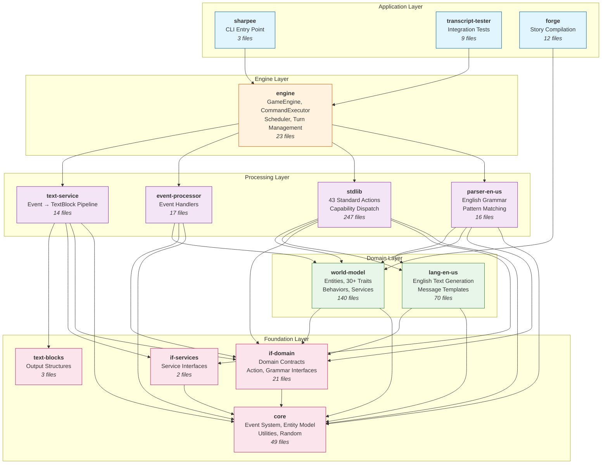

# Package Dependency Graph

This diagram shows the build-time dependencies between Sharpee packages, organized by architectural layer.

## Diagram



## Layer Descriptions

### Foundation Layer
Pure contracts and utilities with no platform-specific dependencies.

| Package | Purpose | External Dependencies |
|---------|---------|----------------------|
| `core` | Event system, entity interfaces, utilities | `eventemitter3` |
| `if-domain` | Domain contracts (actions, grammar, validation) | None |
| `if-services` | Runtime service interfaces | None |
| `text-blocks` | Output structure definitions | None |

### Domain Layer
Core domain logic for world representation and language.

| Package | Purpose | Key Exports |
|---------|---------|-------------|
| `world-model` | Entity system, traits, behaviors, services | `WorldModel`, `IFEntity`, 30+ traits |
| `lang-en-us` | English text generation, message templates | `LanguageProvider`, message maps |

### Processing Layer
Command processing, actions, and output generation.

| Package | Purpose | Key Exports |
|---------|---------|-------------|
| `stdlib` | 43 standard actions, capability dispatch | All IF actions, `CapabilityBehavior` |
| `parser-en-us` | English grammar, pattern matching | `Parser`, `GrammarBuilder` |
| `event-processor` | Event application, handlers | `EventProcessor`, handler registry |
| `text-service` | Event → TextBlock pipeline | `TextService` |

### Engine Layer
Orchestration and turn management.

| Package | Purpose | Key Exports |
|---------|---------|-------------|
| `engine` | Game loop, command execution, scheduler | `GameEngine`, `CommandExecutor`, `Scheduler` |

### Application Layer
Entry points and tooling.

| Package | Purpose | Key Exports |
|---------|---------|-------------|
| `sharpee` | CLI entry point, bundle | CLI commands |
| `transcript-tester` | Integration test runner | Test CLI |
| `forge` | Story compilation tools | Compiler utilities |

## Dependency Rules

### Allowed Dependencies (by layer)

| Layer | Can Depend On |
|-------|---------------|
| Application | Engine, Processing, Domain, Foundation |
| Engine | Processing, Domain, Foundation |
| Processing | Domain, Foundation |
| Domain | Foundation |
| Foundation | Nothing (except external libs) |

### Key Coupling Points

| Coupling | Reason | Assessment |
|----------|--------|------------|
| `stdlib` → `lang-en-us` | Message ID resolution | Appropriate |
| `parser` → `lang-en-us` | Vocabulary lookup | Appropriate |
| `parser` → `world-model` | Entity resolution | Appropriate |
| `eventproc` ↔ `world-model` | Bidirectional awareness | Acceptable |

## Build Order

Packages must be built in dependency order:

```
1. core
2. text-blocks, if-domain, if-services  (parallel)
3. world-model, lang-en-us              (parallel)
4. event-processor, stdlib, parser      (parallel, after 3)
5. text-service                         (after 4)
6. engine                               (after 5)
7. sharpee, transcript-tester, forge    (parallel, after 6)
```

## Package Statistics

| Package | Files | ~LOC | Primary Responsibility |
|---------|-------|------|------------------------|
| `core` | 49 | 3,500 | Event system, utilities |
| `if-domain` | 21 | 1,500 | Contracts |
| `if-services` | 2 | 200 | Service interfaces |
| `text-blocks` | 3 | 300 | Output types |
| `world-model` | 140 | 12,000 | Entities, traits |
| `lang-en-us` | 70 | 5,000 | Text generation |
| `stdlib` | 247 | 15,000 | Actions |
| `parser-en-us` | 16 | 2,500 | Grammar |
| `event-processor` | 17 | 2,000 | Event handlers |
| `text-service` | 14 | 2,000 | Text pipeline |
| `engine` | 23 | 4,000 | Orchestration |
| `sharpee` | 3 | 500 | CLI |
| `transcript-tester` | 9 | 1,500 | Testing |
| `forge` | 12 | 1,500 | Compilation |
| **Total** | **626** | **~51,500** | |

## Related ADRs

- ADR-005: Action Interface Location
- ADR-007: Actions in Standard Library
- ADR-008: Core Package as Generic Event System
- ADR-030: If-Services Package
- ADR-077: Release Build System
