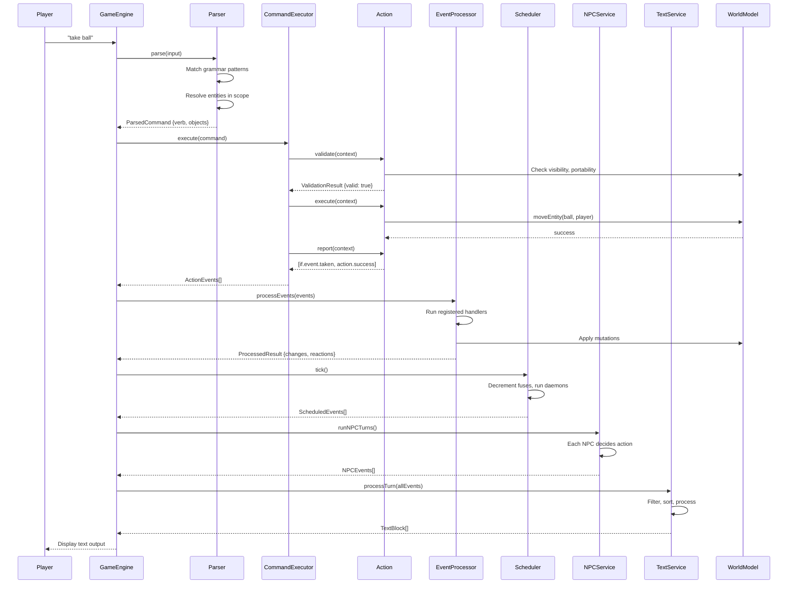

# Turn Cycle Sequence Diagram

This diagram shows the complete flow of a single turn in the Sharpee engine, from player input to text output.

## Diagram

## Phase Descriptions

### 1. Parse (Parser)
- Tokenizes player input
- Matches against grammar patterns (ADR-087)
- Resolves entity references using scope system
- Output: `ParsedCommand` with verb and resolved objects

### 2. Execute (CommandExecutor + Action)
The four-phase action pattern (ADR-051):

| Phase | Purpose | Output |
|-------|---------|--------|
| **validate** | Check preconditions | `ValidationResult` |
| **execute** | Mutate world state | Side effects on `WorldModel` |
| **report** | Describe what happened | `ISemanticEvent[]` |
| **blocked** | Explain failure (if validation failed) | `ISemanticEvent[]` |

### 3. Process Events (EventProcessor)
- Applies events to world model
- Runs registered handlers (story-level and entity-level)
- Handlers can emit reaction events (processed recursively)
- Output: `ProcessedResult` with changes and reactions

### 4. Scheduler Tick
- Decrements fuse counters
- Runs daemon callbacks
- Emits scheduled events (e.g., lantern dying)
- See ADR-071 for daemons and fuses

### 5. NPC Turns (NPCService)
- Each NPC with `NpcTrait` gets a turn
- Behavior's `onTurn()` method decides action
- NPCs can move, attack, speak, or idle
- See ADR-070 for NPC architecture

### 6. Render Text (TextService)
- Filters out system/debug events
- Sorts events for narrative coherence (ADR-094)
- Routes to event-specific handlers
- Assembles `TextBlock[]` with decorations
- See ADR-096 for text service pipeline

## Key Files

| Component | Location |
|-----------|----------|
| GameEngine | `packages/engine/src/game-engine.ts` |
| Parser | `packages/parser-en-us/src/english-parser.ts` |
| CommandExecutor | `packages/engine/src/command-executor.ts` |
| Actions | `packages/stdlib/src/actions/standard/` |
| EventProcessor | `packages/event-processor/src/processor.ts` |
| Scheduler | `packages/engine/src/scheduler/` |
| NPCService | `packages/world-model/src/services/npc-service.ts` |
| TextService | `packages/text-service/src/text-service.ts` |

## Related ADRs

- ADR-004: Parser-Validation-Execution Separation
- ADR-051: Four-Phase Action Pattern
- ADR-052: Event Handlers for Custom Logic
- ADR-070: NPC System Architecture
- ADR-071: Daemons and Fuses
- ADR-094: Event Sorting
- ADR-096: Text Service Pipeline
