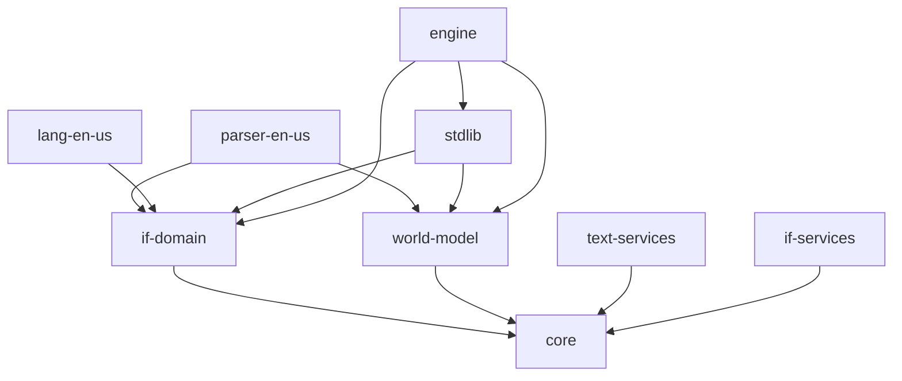

# Package Documentation

This directory contains detailed documentation for each package in the Sharpee framework.

## Core Packages

### Foundation
- **[@sharpee/core](./core/)** - Core utilities, types, and interfaces
  - Event system
  - Result types
  - Common utilities

- **[@sharpee/if-domain](./if-domain/)** - Interactive fiction domain models
  - Parser interfaces
  - Language provider interfaces
  - Vocabulary types

### Runtime
- **[@sharpee/engine](./engine/)** - Game engine and runtime
  - Game loop management
  - Command execution
  - State management
  - Event processing

- **[@sharpee/world-model](./world-model/)** - Entity-Component System
  - Entity management
  - Trait system
  - Relationships
  - Spatial model

### Language Processing
- **[@sharpee/parser-en-us](./parser-en-us/)** - English language parser
  - Grammar rules
  - Tokenization
  - Command parsing
  - Scope resolution

- **[@sharpee/lang-en-us](./lang-en-us/)** - English language provider
  - Vocabulary data
  - Message templates
  - Verb conjugation
  - Pluralization

### Actions & Behaviors
- **[@sharpee/stdlib](./stdlib/)** - Standard library
  - Common actions (take, drop, look, etc.)
  - Capabilities (movement, manipulation, etc.)
  - Standard traits
  - Helper utilities

### Services
- **[@sharpee/text-services](./text-services/)** - Text formatting and output
  - Message formatting
  - Text channels
  - Output styling

- **[@sharpee/if-services](./if-services/)** - Interactive fiction services
  - Save/load functionality
  - Query system
  - Platform abstraction

## Package Dependencies



## Package Conventions

### Structure
Each package follows this structure:
```
packages/[package-name]/
├── src/              # Source code
├── tests/            # Test files
├── docs/             # Package-specific docs
├── package.json      # Package configuration
├── tsconfig.json     # TypeScript config
└── README.md         # Package overview
```

### Naming
- Packages use `@sharpee/` namespace
- Names are lowercase with hyphens
- Clear, descriptive names

### Versioning
- All packages version together
- Follow semantic versioning
- Currently at 0.1.0

## Development

### Building a Package
```bash
# Build specific package
pnpm --filter @sharpee/[package-name] build

# Build with dependencies
pnpm --filter @sharpee/[package-name]... build
```

### Testing a Package
```bash
# Test specific package
pnpm --filter @sharpee/[package-name] test

# Test with coverage
pnpm --filter @sharpee/[package-name] test:coverage
```

### Adding Dependencies
```bash
# Add to specific package
pnpm --filter @sharpee/[package-name] add [dependency]

# Add dev dependency
pnpm --filter @sharpee/[package-name] add -D [dependency]
```

## Package Guidelines

### Public API
- Export through index.ts
- Use explicit exports (no `export *`)
- Document with JSDoc
- Maintain backward compatibility

### Internal Code
- Keep in `src/internal/`
- Don't export from index
- Can change without notice

### Testing
- Unit tests for all public APIs
- Integration tests for complex features
- Maintain >80% coverage

### Documentation
- README with overview and examples
- JSDoc for all public APIs
- Migration guides for breaking changes

## Creating a New Package

1. Create directory under `packages/`
2. Copy package.json template
3. Set up TypeScript configuration
4. Create src/index.ts
5. Add tests
6. Document in README
7. Add to this index

## Package Maintenance

### Deprecation
- Mark with @deprecated in JSDoc
- Provide migration path
- Remove after 2 major versions

### Breaking Changes
- Document in CHANGELOG
- Provide migration guide
- Update major version

## Resources

- [Architecture Documentation](../architecture/)
- [API Reference](../api/)
- [Development Guide](../development/)
- [Contributing Guide](../development/guides/contributing.md)