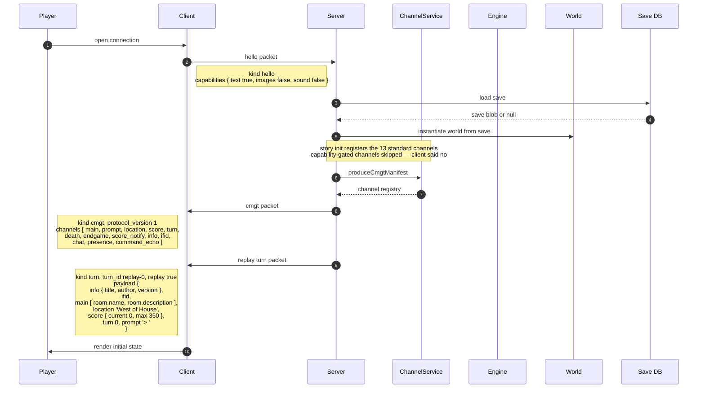
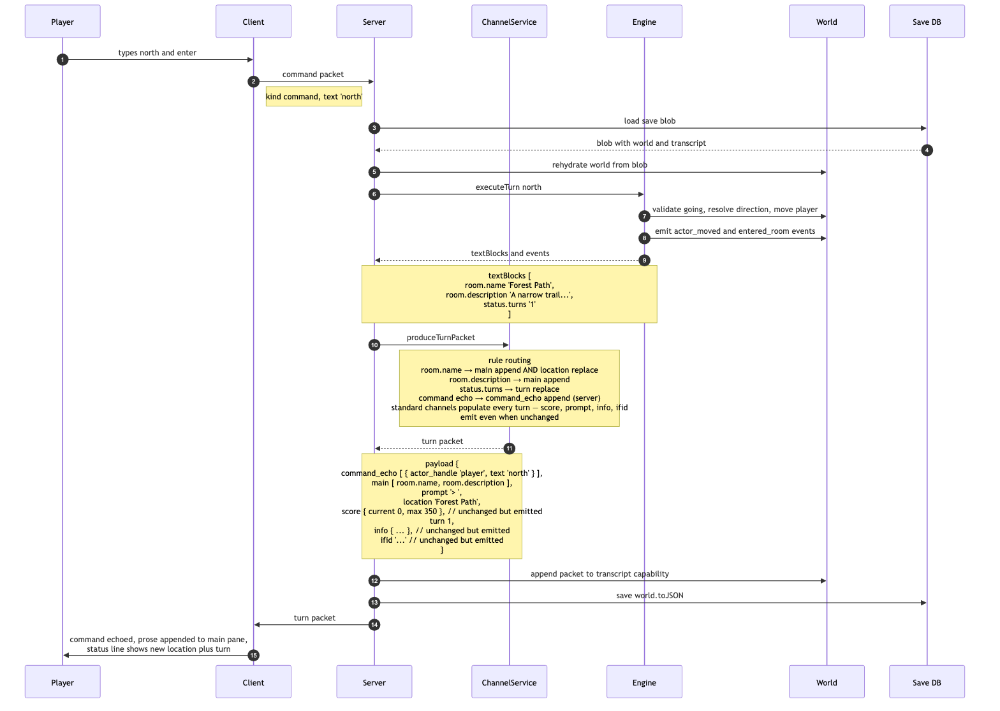
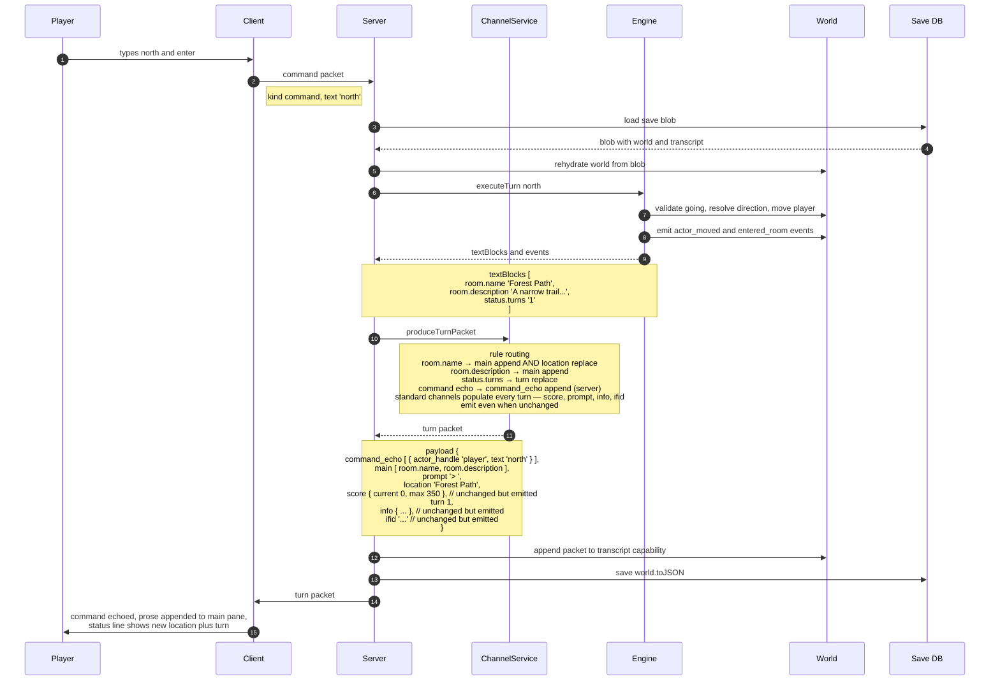

# Dungeo + channel-service — new paradigm walkthrough

**Date:** 2026-04-29
**Purpose:** Trace a Dungeo session under the ADR-163/164 channel-I/O wire model. Companion to `dungeo-text-service-walkthrough.md`, which traces the same session under today's text-service paradigm.

**Source:** Extracted from `sequence-diagrams-20260429.md` §1 for use as a standalone reference. The full source doc also contains The Alderman walkthrough (author-controlled UX) and a validation matrix; this excerpt focuses on the vanilla-IF case.

**Conventions:**

- "Server / Host" means the Node host process. In multi-user that's the (rebuilt) `tools/server`; in single-user (zifmia, CLI, platform-browser) it's the local runtime. The wire shape is identical; the transport differs (WebSocket vs in-process).
- "Save DB" is the source of truth for per-room engine state under stateless multi-user. In single-user it's a local file or in-memory cache.
- Mermaid sequence diagrams keep arrow messages short (verb phrases) — payload detail lives in adjacent Notes. Read each arrow plus the Notes around it as one logical step.

---

## 1. Bootstrap — connection and CMGT

A standard interactive-fiction session start: connect, see the opening room. Uses **only platform-standard channels** — no story-defined channels. The platform's default web client renders this without any custom assets.

---

## 2. Player turn — `> north`

### What this turn demonstrates

- **Standard channels populate every turn.** `score`, `prompt`, `info`, `ifid` are emitted with their current values even though they didn't change. Replace-mode standard channels carry "current state"; append-mode standard channels (here `main`, `command_echo`) carry the turn's deltas. (ADR-163 invariant: standard populate-every-turn; story channels sparse.)
- **One TextBlock routes to two channels.** `room.name` → `main` (append, narrative) AND `location` (replace, status bar). Platform default rule set handles this; stories don't write rules for vanilla cases.
- **Server-sourced channel.** `command_echo` is populated by `produceTurnPacket`'s `command` input parameter, not by an engine TextBlock.
- **Save round-trip is the hot path.** Every turn loads from DB, executes, saves back. The transcript capability accumulates the packet.

---

## 3. Why this matters

For a vanilla-IF story like Dungeo, the channel-I/O wire is *strictly more capable* than the text-service paradigm with no extra burden on the author:

- The same engine emissions (TextBlocks + events) feed the producer.
- The platform's default rule set handles all standard routing — a Dungeo author writes zero channel code.
- The default web client renders all 13 standard channels out of the box.
- Capability negotiation lets a text-only client opt out of media channels cleanly; a richer client can opt in later without engine changes.
- The transcript capability accumulates packets, giving late-joining clients (multi-user co-watch, refresh recovery) a canonical replay.

The author-controlled-UX cases (story-defined channels, custom verbs, UI-click round-trips) are covered in `sequence-diagrams-20260429.md` §2 (The Alderman). For Dungeo the message is simpler: same wire, more headroom.

---

## 4. References

- ADR-163: Stateless Multi-User Server with Channel I/O (defines the 13 standard channels, CMGT protocol, stateless design)
- ADR-164: Channel I/O Everywhere (universal wire across all surfaces; supersedes ADR-101)
- `sequence-diagrams-20260429.md` — full source including The Alderman author-controlled-UX walkthrough
- `dungeo-text-service-walkthrough.md` — companion doc showing the same Dungeo turn under today's paradigm
