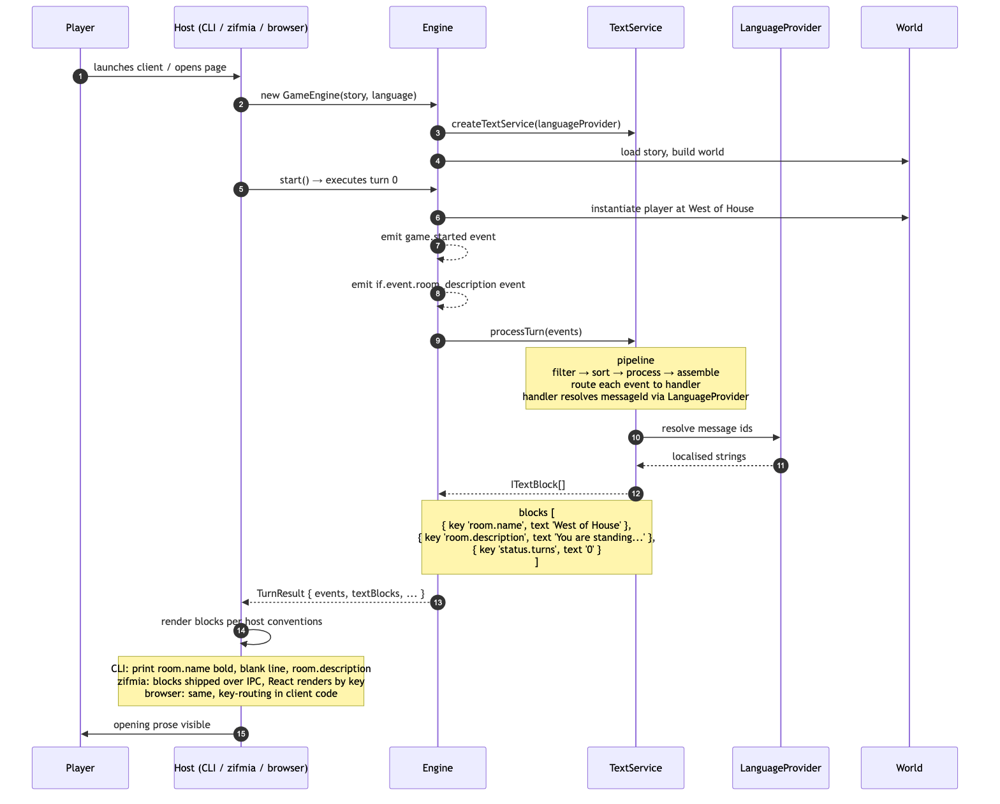
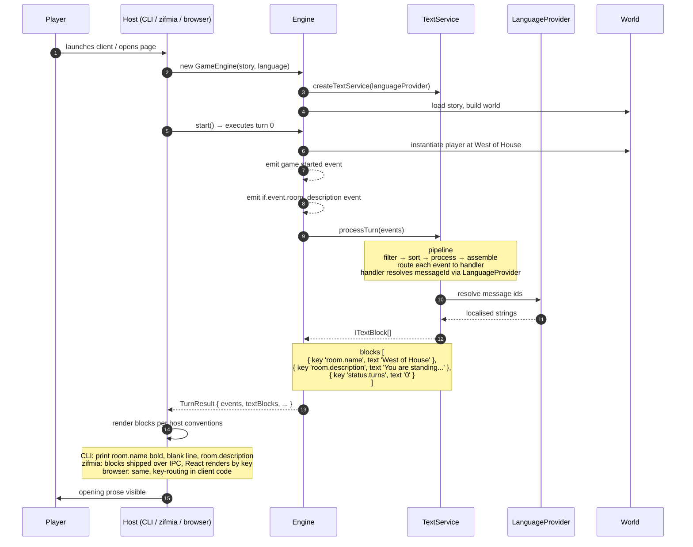
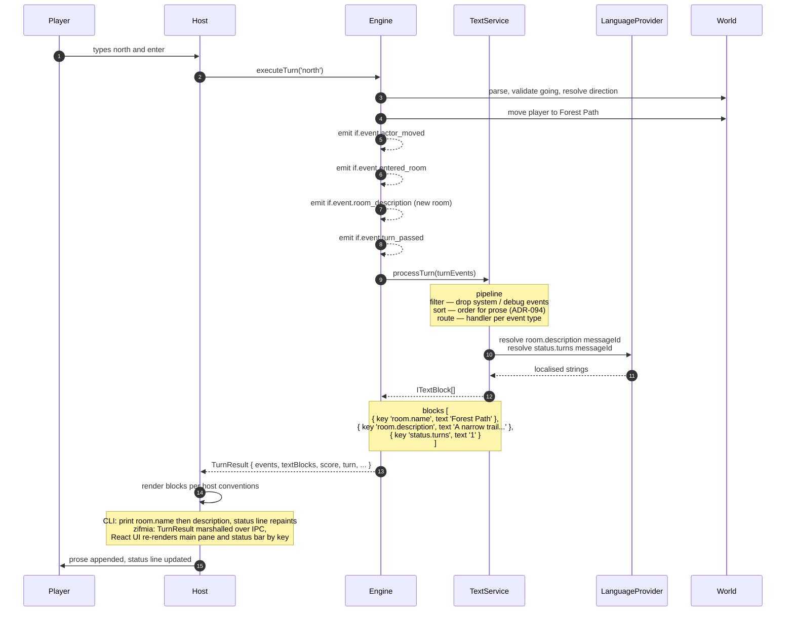

# Dungeo + text-service — current paradigm walkthrough

**Date:** 2026-04-29
**Purpose:** Trace a Dungeo session under today's text-service architecture (ADR-096 / ADR-133). Companion to `dungeo-channel-service-walkthrough.md`, which traces the same session under the ADR-163/164 channel-service paradigm.

**Scope:** This is the *as-is* picture. text-service is retired as a wire producer in ADR-164; this doc captures what the platform looks like before that change.

**Conventions:**

- text-service is **in-process**. The "wire" between engine and host is the `TurnResult` shape — a structured result object containing `events`, `textBlocks`, and ancillary fields. There is no over-the-network packet schema; each host surface (CLI, zifmia, platform-browser) serialises `TurnResult` its own way.
- "Host" means whatever embeds the engine: `dist/cli/sharpee.js` for CLI, the Tauri shell for zifmia, the React app for platform-browser.
- TextBlocks are typed prose chunks: `{ key: 'room.name', text: 'Forest Path' }`, `{ key: 'room.description', text: '...' }`, `{ key: 'status.turns', text: '1' }`, etc. The host decides where each key routes.

---

## 1. Bootstrap — game start

A standard Dungeo session: player launches the CLI (or web client), engine boots, story loads, the first turn (turn 0) emits the opening room description.

### What 1 demonstrates

- **No handshake.** No capability negotiation, no manifest. The host knows what blocks to expect because it ships against the same engine version.
- **Pipeline runs every turn.** `filter → sort → process → assemble` is run inside `processTurn`. Stateless transformer: events in, blocks out.
- **Block keys are the contract.** `room.name`, `room.description`, `status.turns` — the host has hardcoded knowledge of these keys to decide which UI surface renders them.
- **No wire schema.** `TurnResult` is a TypeScript type. Each host serialises it differently for its rendering surface.

---

## 2. Player turn — `> north`

### What 2 demonstrates

- **In-process call, not a packet.** `processTurn(events) → ITextBlock[]` is a synchronous method call inside the engine. The host receives `TurnResult` directly.
- **Block array is flat.** No grouping, no channel ids, no replace-vs-append semantics. The host scans the array and decides what to do with each key.
- **One block per surface, by convention.** `room.name` typically goes to *both* the main pane (as a heading) and the status bar (as a location label) — but text-service doesn't say so. The host duplicates that decision in two places.
- **No structured non-prose data path.** If a story wants to emit a deduction-card payload or an image reference, there's no slot for it. Stories that need this today have invented side channels (custom events, capability hacks, or post-turn DOM manipulation in the host).
- **Save/load is host-owned.** text-service has no role in persistence. The engine serialises world state on demand; text-service is purely transformation.

---

## 3. Where this paradigm runs out

Drawing 1 and 2 surfaces the limits without needing to bring in non-IF examples:

1. **No handshake.** Capability negotiation (does the client render images? sound? animations?) has no place to live. Each host hardcodes what it can do.
2. **No wire.** Three surfaces (CLI, zifmia, browser) each serialise `TurnResult` differently. A multi-user server has no defined packet to send.
3. **Routing is duplicated.** `room.name` → main pane *and* status bar lives in host code. Add a fourth host (mobile, web embed, transcript replayer) and you copy the routing rules.
4. **Prose-shaped only.** TextBlocks carry strings. Structured data (notebook state, evidence cards, image refs, sound triggers) has nowhere to ride.
5. **No replace vs append semantics.** A status update and a narrative line look identical in the block list. The host infers from the key prefix what to do.
6. **No populate-every-turn invariant.** A new client connecting mid-session has no canonical "current state" to render — it has to wait for the next turn and hope all surfaces refresh.

These aren't bugs in text-service. They're the consequences of the design boundary: text-service is a **prose transformer for a single in-process renderer**. Channel I/O extends that boundary outward — to a wire that supports multiple clients, structured payloads, capability-aware filtering, and author-supplied renderers.

---

## 4. text-service vs channel-service at a glance

| Concern                       | text-service (today)                            | channel-service (ADR-163/164)                     |
| ----------------------------- | ----------------------------------------------- | ------------------------------------------------- |
| Output shape                  | flat `ITextBlock[]`                             | keyed `TurnPacket` per channel                    |
| Output transport              | in-process (`TurnResult` field)                 | wire packet (`kind: 'turn'`)                      |
| Non-prose data                | no slot                                         | first-class (`json` channels)                     |
| Client routing                | hardcoded key conventions in host code          | declared at channel registration                  |
| Capability negotiation        | none                                            | `hello` → `cmgt` manifest                         |
| Author-defined channels       | n/a                                             | story registers channels + ships renderer         |
| Replace vs append semantics   | implicit per key                                | declared per channel                              |
| Per-turn populate policy      | implicit                                        | `emit: 'always' \| 'sparse'` per channel          |
| Multi-user / late join        | not addressed                                   | replay packet on connect                          |
| Inspiration                   | FyreVM channel I/O (2009) — partial             | FyreVM channel I/O (2009) — completed             |

---

## 5. References

- ADR-096: Text Service Architecture
- ADR-133: Structured TextBlocks from text-service
- ADR-163: Stateless Multi-User Server with Channel I/O (supersedes the wire model implicitly assumed by text-service callers)
- ADR-164: Channel I/O Everywhere — explicit retirement of text-service as a wire producer
- Source: `packages/text-service/src/text-service.ts` — pipeline implementation
- Source: `packages/engine/src/game-engine.ts:879` — engine call site
