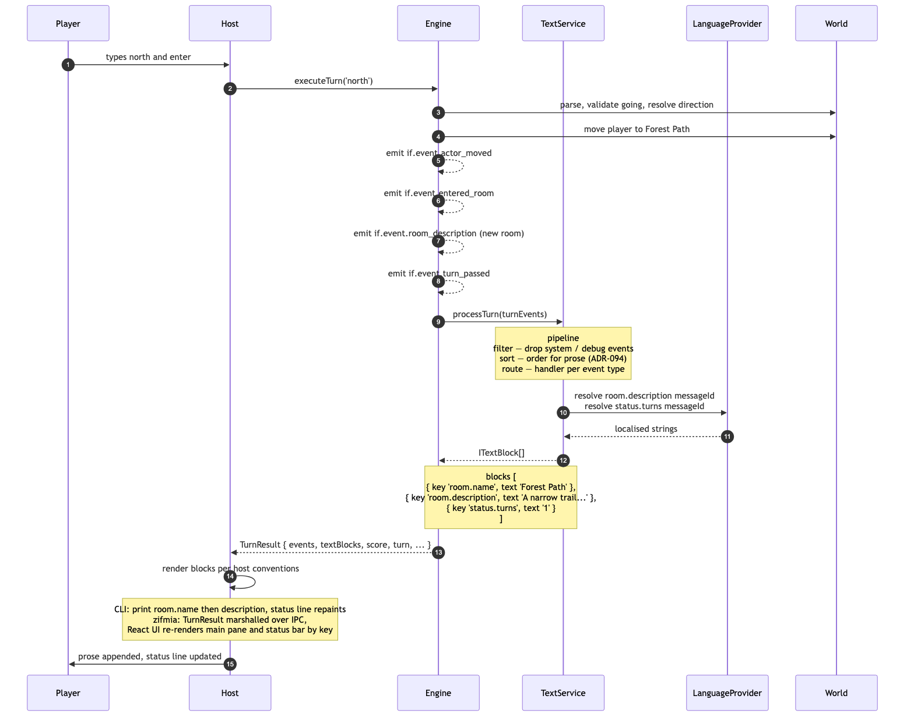

# From TextBlocks to Channels: how Sharpee's wire is changing

**Draft for blog post — 2026-04-29**

Sharpee is a parser-based interactive-fiction authoring platform. The engine produces *something* per turn; the client renders it. That "something" has a shape, and the shape is changing.

Since 2025 the shape has been **TextBlocks** — typed prose chunks emitted by a service called `text-service`. This year's architectural work (ADR-163 and ADR-164) retires that surface in favour of a **channel-based wire** with capability negotiation, structured payloads, and author-controlled rendering.

This post is the side-by-side: same Dungeo turn, two paradigms, and why the second one is where Sharpee was always going.

---

## What text-service does today

text-service (ADR-096) is a stateless transformer. Engine emits semantic events during a turn; after the turn completes, text-service runs a four-stage pipeline — filter, sort, process, assemble — and produces a flat array of `ITextBlock`. Each block is a typed prose chunk: `room.name`, `room.description`, `status.turns`, `action.result`, and so on.

The host (CLI, zifmia, platform-browser) takes the array and decides where each block goes. The main pane gets `room.name` and `room.description`. The status bar gets `status.turns` and (by host convention) re-uses `room.name` as a location label. Each host hardcodes those routing rules.

Three properties matter:

- **In-process.** text-service runs inside the engine. Its output is a TypeScript value, not a wire packet. Each surface serialises that value its own way — the CLI prints it, zifmia marshals it over IPC, the browser ships it through React.
- **Prose-shaped.** TextBlocks carry strings. That's the contract.
- **Implicit routing.** No channel ids, no replace-vs-append semantics, no per-key emit policy. Block keys are the contract; hosts know what to do with them.

text-service was explicitly inspired by FyreVM channel I/O (Sharpee's spiritual predecessor, circa 2009) — but it stopped short of channels. It produces blocks; the routing-to-channels piece never landed.

## A Dungeo turn under text-service

Player types `> north`. Engine validates, executes the going action, emits `actor_moved`, `entered_room`, `room_description`, `turn_passed`. Engine calls `textService.processTurn(events)`. The pipeline filters out system events, sorts the survivors for prose order, routes each to a handler. Handlers resolve message ids through the language provider and assemble TextBlocks: `room.name 'Forest Path'`, `room.description 'A narrow trail...'`, `status.turns '1'`. Engine returns a `TurnResult` containing those blocks. The host renders them.

Full sequence diagram: `dungeo-text-service-walkthrough.md`.

## Where it runs out

The diagram makes the limits visible without arguing about them:

- **No handshake.** Capability negotiation has nowhere to live. Each host hardcodes what it can render.
- **No wire.** Three surfaces, three serialisations. A multi-user server has no defined packet to send.
- **Routing is duplicated.** `room.name` → main pane *and* status bar lives in host code. Add a fourth host and you copy the rules.
- **Prose-shaped only.** Structured data (deduction-game state, evidence cards, image refs, sound triggers) has nowhere to ride.
- **No populate-every-turn invariant.** A late-joining client has no canonical "current state" to render.

These aren't bugs. They're the consequences of the boundary text-service drew: a prose transformer for a single in-process renderer.

## What channel-service does instead

ADR-163 and ADR-164 replace TextBlocks-as-wire with **channels-as-wire**.

A channel is a named, typed slot. The platform ships 13 standard channels: `main`, `prompt`, `location`, `score`, `turn`, `death`, `endgame`, `score_notify`, `info`, `ifid`, `chat`, `presence`, `command_echo`. Each channel declares whether it's `append` or `replace` mode and whether it emits `'always'` or `'sparse'`. Stories can register more channels with their own JSON shapes.

Each turn the engine still emits TextBlocks and events; channel-service routes them to channels via a rule table (platform defaults plus story-registered rules) and produces a single `TurnPacket`. The packet ships over the wire. The client receives it, looks up each channel's mode, and updates its UI accordingly.

The handshake is explicit. Client sends `hello` with its capabilities (`text`, `images`, `sound`, ...). Server responds with `cmgt` — the channel manifest, filtered by capability. After that, every turn produces a `kind: 'turn'` packet with current channel values.

Three properties matter:

- **Wire-shaped.** Defined packets, defined kinds, defined transport. WebSocket for multi-user, in-process for single-user — same packets either way.
- **Data-shaped, not prose-shaped.** `json` channels carry structured payloads. `evidence`, `notebook`, `case_candidates` are first-class.
- **Author-overridable.** Platform ships defaults; any story can override the renderer for any channel. The wire stays data-only — anything the wire encodes as presentation is something authors can never override, so it doesn't.

## The same Dungeo turn under channel-service

Player connects. Client sends `hello { text: true, images: false, sound: false }`. Server registers the 13 standard channels, skips media channels (capability said no), and ships `cmgt`. A replay packet follows with the current state.

Player types `> north`. Server loads the save blob, rehydrates the world, calls `executeTurn('north')`. Engine emits the same TextBlocks and events as before. Server calls `produceTurnPacket(textBlocks, events, command, prevValues)`. Channel-service runs its rule table: `room.name` → `main` (append) AND `location` (replace); `room.description` → `main` (append); `status.turns` → `turn` (replace); the command itself → `command_echo` (server-sourced). Standard `'always'` channels (`score`, `prompt`, `info`, `ifid`) emit their current values regardless of change.

Server appends the packet to the transcript capability, saves the world, sends the packet to the client. Client renders.

Full sequence diagram: `dungeo-channel-service-walkthrough.md`.

## The diff that matters

| Concern                       | text-service (today)                      | channel-service (ADR-163/164)              |
| ----------------------------- | ----------------------------------------- | ------------------------------------------ |
| Output shape                  | flat `ITextBlock[]`                       | keyed `TurnPacket` per channel             |
| Output transport              | in-process (`TurnResult` field)           | wire packet (`kind: 'turn'`)               |
| Non-prose data                | no slot                                   | first-class (`json` channels)              |
| Client routing                | hardcoded key conventions                 | declared at channel registration           |
| Capability negotiation        | none                                      | `hello` → `cmgt` manifest                  |
| Author-defined channels       | n/a                                       | story registers + ships renderer           |
| Replace vs append semantics   | implicit per key                          | declared per channel                       |
| Per-turn populate policy      | implicit                                  | `emit: 'always' \| 'sparse'`               |
| Multi-user / late join        | not addressed                             | replay packet on connect                   |
| Inspiration                   | FyreVM channel I/O — partial              | FyreVM channel I/O — completed             |

## Why now

text-service got Dungeo shipped. It was the right call at the time — building a wire protocol before having a working story would have been speculative architecture, and Sharpee needed a working story to burn the platform into shape.

But channel I/O has been the design intent since the FyreVM-server era around 2010. ADR-101 (graphical client architecture, January 2026) and ADR-163 (stateless multi-user, April 2026) both independently re-derived the same conclusion: the wire must be data-only and the renderer must be author-overridable. Two ADRs reaching the same destination from different directions is a strong signal the destination is right.

The pivot to stateless multi-user (ADR-163) made channel-service unavoidable: a multi-user server cannot serve a `TurnResult` over a websocket. ADR-164 followed by extending the same wire to single-user surfaces — one wire across CLI, zifmia, platform-browser, and the multi-user server.

## What's next

ADR-164 is accepted; the implementation is staged:

- **ADR-165 (next):** Asset pipeline — `.sharpee` bundle layout for assets, author-shipped renderer JS, serving and security.
- **`packages/channel-service/`:** New package implementing the producer and the rule table.
- **Migration:** CLI → platform-browser → zifmia, with text-service phased out as each surface adopts the wire.
- **The Alderman as proving ground:** ADR-164 cites a Clue-style deduction game (currently a `.jsx` sketch in `stories/thealderman/docs/`) as the canonical author-controlled-UX example. Building it out exercises every load-bearing piece of the new model.

text-service may stick around as an internal content-assembly convenience if useful, but it no longer owns the surface between engine and client. The wire is channels.

---

## Reference

- **ADR-163:** Channel-Service Platform — Universal Wire and Author-Controlled Media — `docs/architecture/adrs/adr-163-channel-service-platform.md`
- **ADR-164:** Stateless Multi-User Server — Channel I/O on a Per-Turn Worker — `docs/architecture/adrs/adr-164-stateless-multiuser-server.md`
- **ADR-096:** Text Service Architecture (the paradigm being retired)
- **ADR-133:** Structured TextBlocks from text-service
- **Dungeo + text-service walkthrough:** `docs/work/channel-io-unification/dungeo-text-service-walkthrough.md`
- **Dungeo + channel-service walkthrough:** `docs/work/channel-io-unification/dungeo-channel-service-walkthrough.md`
- **Full sequence diagrams** (Dungeo + The Alderman): `docs/work/channel-io-unification/sequence-diagrams-20260429.md`
- **ADR-101 audit** (what channel-service replaces from the graphical-client design): `docs/work/channel-io-unification/audit-20260429-adr-101.md`
