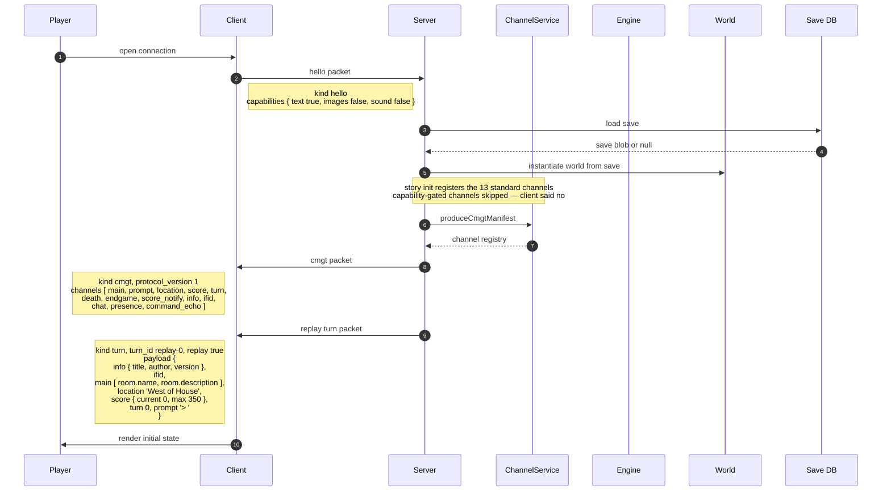
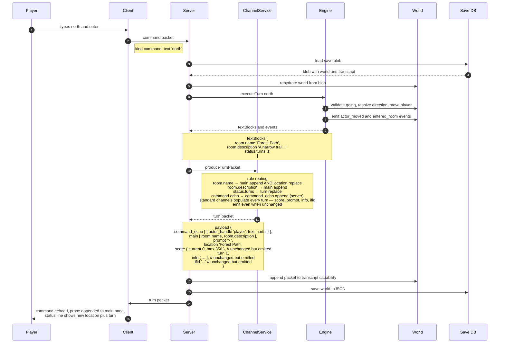
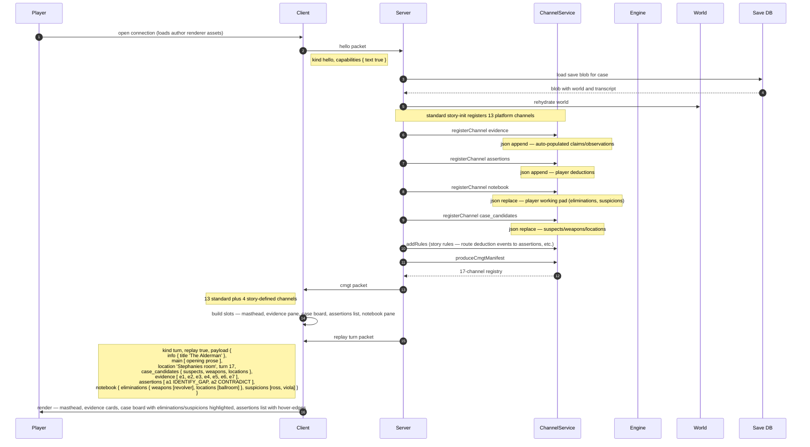
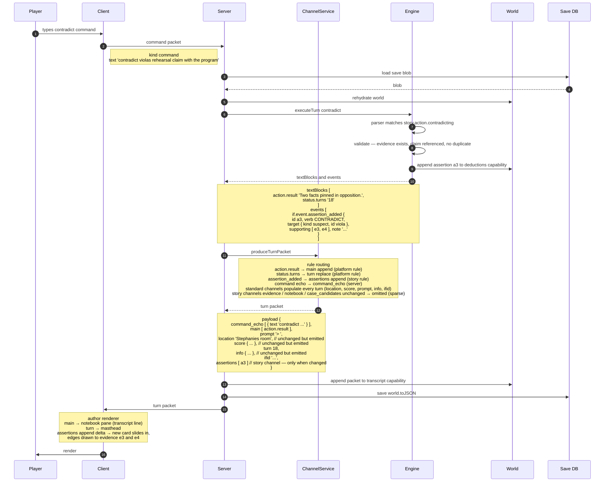
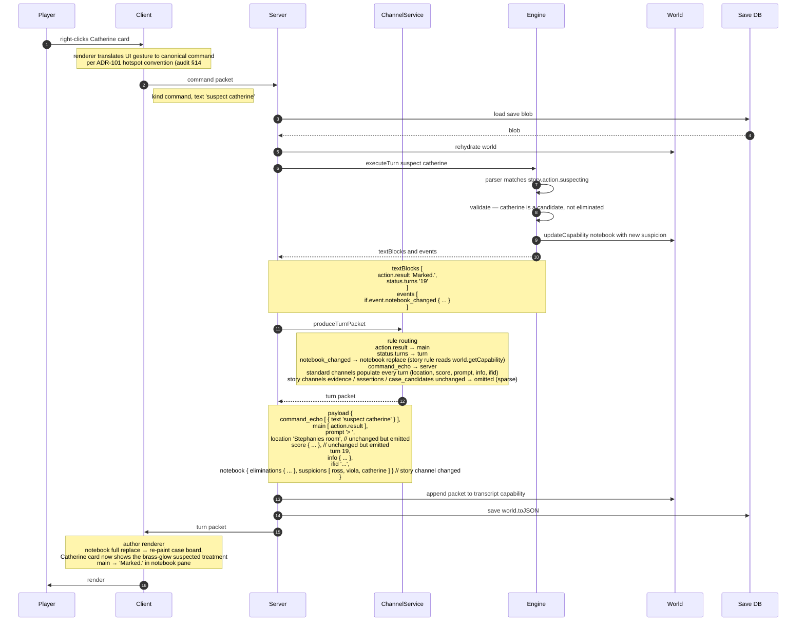

# Channel I/O Sequence Diagrams — Dungeo + The Alderman

**Date:** 2026-04-29
**Purpose:** Walk through concrete turn-by-turn message flows under the ADR-163 channel-I/O wire model, using Dungeo (a vanilla IF story that exists) and The Alderman (a deduction-game UX that exists only as a `.jsx` sketch). The Alderman diagrams are forward-looking — the story isn't built — but the channel registrations and routing match the sketch in `stories/thealderman/docs/detective-sheet.jsx`.

**Conventions:**

- "Server / Host" means the Node host process. In multi-user that's the (rebuilt) `tools/server`; in single-user (zifmia, CLI, platform-browser) it's the local runtime. The wire shape is identical; the transport differs (WebSocket vs in-process).
- "Save DB" is the source of truth for per-room engine state under stateless multi-user. In single-user it's a local file or in-memory cache.
- Mermaid sequence diagrams keep arrow messages short (verb phrases) — payload detail lives in adjacent Notes. Read each arrow plus the Notes around it as one logical step.

---

## 1. Dungeo — vanilla IF

A standard interactive-fiction session: connect, see the opening room, type a command, see the result. Uses **only platform-standard channels** — no story-defined channels. The platform's default web client renders this without any custom assets.

### 1a. Bootstrap — connection and CMGT

### 1b. Player turn — `> north`

### What 1b demonstrates

- **Standard channels populate every turn.** `score`, `prompt`, `info`, `ifid` are emitted with their current values even though they didn't change. Replace-mode standard channels carry "current state"; append-mode standard channels (here `main`, `command_echo`) carry the turn's deltas. (ADR-163 invariant: standard populate-every-turn; story channels sparse.)
- **One TextBlock routes to two channels.** `room.name` → `main` (append, narrative) AND `location` (replace, status bar). Platform default rule set handles this; stories don't write rules for vanilla cases.
- **Server-sourced channel.** `command_echo` is populated by `produceTurnPacket`'s `command` input parameter, not by an engine TextBlock.
- **Save round-trip is the hot path.** Every turn loads from DB, executes, saves back. The transcript capability accumulates the packet.

---

## 2. The Alderman — author-controlled UX

A deduction-game session matching the case-board sketch in `stories/thealderman/docs/detective-sheet.jsx`. **Author-supplied renderer**, **story-defined channels** (`evidence`, `assertions`, `notebook`, `case_candidates`), **story-specific verbs** (CONTRADICT, IDENTIFY GAP, SUSPECT, CLEAR, ACCUSE).

The wire shape is identical to Dungeo's — same packet kinds, same protocol — but the channel registry is larger and the renderer is the author's notebook UI rather than the platform default.

### 2a. Bootstrap — connection, CMGT, story-defined channels

### 2b. Custom-verb turn — `> contradict viola's rehearsal claim with the program`

The player issues a story-specific deduction verb. The engine routes to a story-defined `contradicting` action. The action mutates the world (appends to a deductions capability), produces a TextBlock for narrative confirmation, and emits an `if.event.assertion_added` event. Channel-service routes the event to the `assertions` channel; routes the TextBlock to `main`.

### 2c. UI-click turn — player right-clicks the Catherine card to mark suspicion

The player's working-pad state (eliminations / suspicions) doesn't live in the world model the engine reasons over — it's a `notebook` capability owned by the consumer side. Per the audit (§14 #4), client-side actions round-trip via **synthesized commands**: the click becomes a parser command the engine processes.

### What 2a–2c demonstrate

- **Same wire model as Dungeo.** Identical packet kinds, identical handshake. The only differences are (a) more channels in the CMGT manifest, (b) story-registered routing rules, (c) author-supplied renderer.
- **Story-defined channels alongside platform channels.** `evidence`, `assertions`, `notebook`, `case_candidates` ride next to `main`, `command_echo`, `turn`. Platform default rules handle the standard channels; story rules handle the custom ones.
- **Custom verbs produce structured channel data.** The CONTRADICT verb emits both a TextBlock (for the prose response in the notebook pane) AND a structured event (for the assertions pane card). Channel-service routes them to different channels in the same turn packet.
- **UI clicks round-trip as synthesized commands.** Client sees "right-click on Catherine → suspect catherine command." The engine treats it identically to a typed command. The notebook capability is the round-trip vehicle, so refresh / mid-session join / multi-user co-watching all see consistent state.
- **Story-channel sparse-emit cuts wire weight.** A SUSPECT turn doesn't re-emit the full evidence list, the assertions list, or the case candidates — only the `notebook` change. Standard channels (`main`, `turn`, `location`, `score`, `prompt`, `info`, `ifid`, `command_echo`) all carry their current values regardless.

---

## 3. What both diagrams together prove

| Claim                                                                 | Where shown                              |
| --------------------------------------------------------------------- | ---------------------------------------- |
| The wire model is independent of UX                                   | Dungeo (default renderer) and Alderman (author renderer) use identical packet kinds and CMGT mechanics |
| Save round-trip is the hot path (every turn)                          | Phases 1b, 2b, 2c all load → execute → save     |
| Per-channel emit policy: standard `'always'`, story default `'sparse'` (opt-in to `'always'` for ephemeral UX) | 1b emits `score`/`prompt`/`info`/`ifid` (all `'always'`) even unchanged; 2b/2c omit unchanged story channels (all default `'sparse'`); a story countdown timer would register with `emit:'always'` and ride every turn |
| Standard channels and story channels coexist on one wire              | Phase 2a CMGT manifest registers 17 channels; phase 2b emits both `main` and `assertions` in one packet |
| Capabilities filter the manifest                                      | Phase 1a / 2a — `image:*` / `sound` channels not registered when client says `images: false, sound: false` |
| Client → server actions go through the command path                   | Phase 2c — UI click becomes a `suspect catherine` command packet |
| Transcript capability captures sparse packets, not full world state   | Phase 1b/2b/2c all append to the transcript capability before save |

---

## 4. Open questions surfaced by drawing these

Three things became sharper while writing the diagrams; worth flagging for ADR-164 review:

1. **Replay packet on connect.** Phases 1a / 2a both show a `kind: 'turn'` with `replay: true` carrying the full transcript synthesis. ADR-163 D8 mentions this informally; ADR-164 needs to specify whether the replay is *one* big packet (with the full state) or *N* small packets (the literal transcript replayed). Drawing showed me the diagrams want one packet (cleaner) but transcript-builder rendering needs N (so animations etc. don't fire). Resolve in ADR-164.

2. **`prevValues` parameter to `produceTurnPacket` — needed only for `'sparse'`-emit channels.** With per-channel emit policy, `prevValues` is needed for any channel registered with `emit: 'sparse'` (regardless of platform vs story origin) so the producer can decide whether to emit. It's not needed for `'always'`-emit channels — the producer just emits current values unconditionally. Under stateless multi-user the cleanest source for `prevValues` is the previous transcript-capability entry, which is self-contained in the save blob — no extra DB hit. Recommend ADR-164 specify: `prevValues` covers all `'sparse'`-emit channels; channel-service recovers them from the prior transcript entry.

3. **Notebook semantic — replace vs append.** Phase 2c shows `notebook` as `replace` mode, emitting the full notebook state. Alternative: `append`-mode emitting deltas like `{ added: { suspicions: ['catherine'] } }`. Replace is simpler, smaller for typical sizes. Append is more bandwidth-efficient if the notebook grows large. For working-pad data the size is tiny — replace wins.

---

## 5. What ADR-164 should pull from these diagrams

The diagrams are not normative — they're a tracing exercise to validate the model. ADR-164 should pull these concrete shapes:

- The CMGT manifest example from §2a (17 channels including 4 story-defined) as the canonical "story registers extra channels" reference.
- The CONTRADICT turn from §2b as the worked example of a custom verb producing a structured channel emission.
- The SUSPECT turn from §2c as the worked example of UI → synthesized command → capability mutation → channel re-emission. This is the canonical example of the audit's §14 #4 callback decision.
- The "what both diagrams together prove" table from §3 as the validation matrix in ADR-164's Acceptance Criteria.

The Dungeo diagrams should be reproducible by anyone reading ADR-163 + ADR-164. The Alderman diagrams should be reproducible from the same two ADRs plus the case-board sketch — that's the existence proof the model is general enough.
