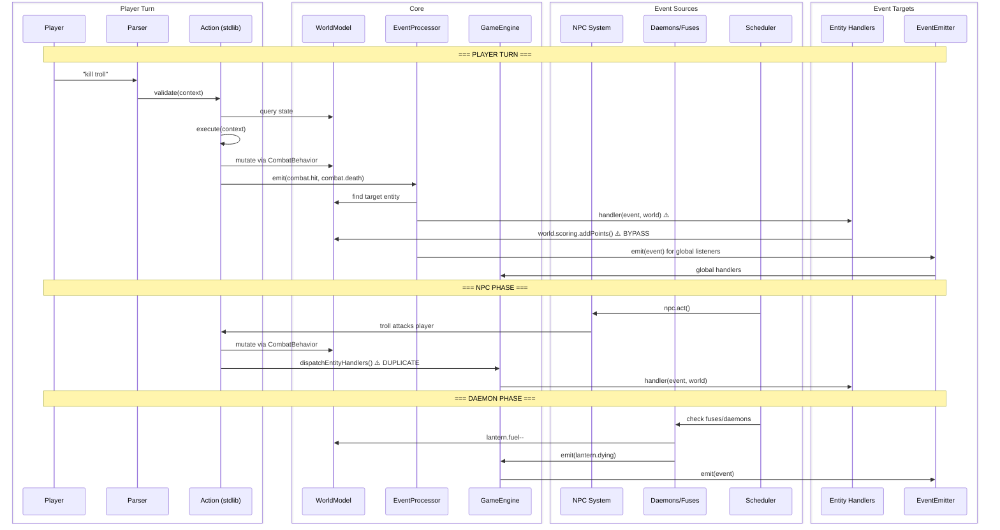
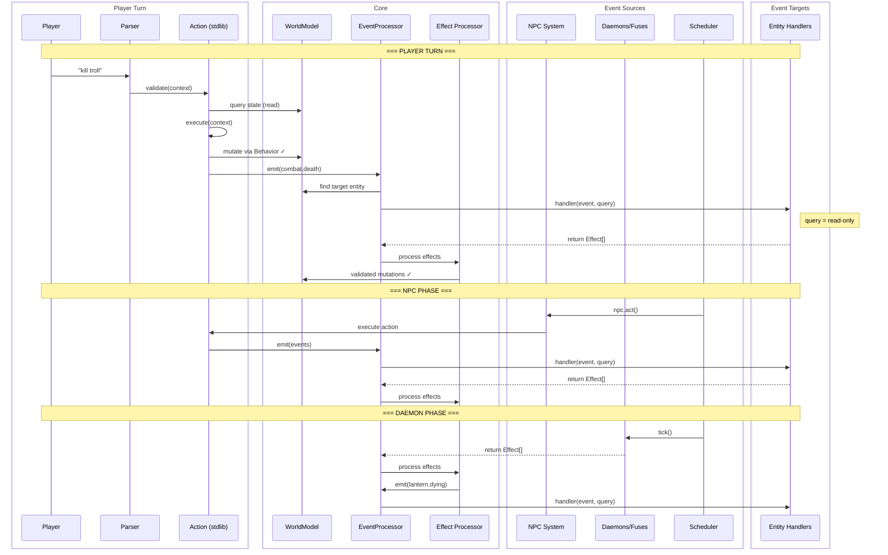

# Event Flow Analysis - All Event-Based Elements

## Current Architecture (With Problems)



## Problems Identified

1. **Two dispatch paths**: EventProcessor vs GameEngine.dispatchEntityHandlers()
2. **World injection**: Handlers get full world, can bypass stdlib
3. **No effect validation**: Direct mutations in handlers
4. **Inconsistent handler types**: EntityEventHandler vs SimpleEventHandler

## Proposed Architecture (Effects-Based)



## Effect Types

```typescript
type Effect =
  | { type: 'score'; points: number; reason?: string }
  | { type: 'flag'; name: string; value: boolean }
  | { type: 'message'; id: string; data?: unknown }
  | { type: 'emit'; event: SemanticEvent }
  | { type: 'schedule'; daemon: string; turns: number }
  | { type: 'mutate'; entityId: string; trait: string; mutation: unknown }  // ← needs validation
```

## Key Changes

| Current | Proposed |
|---------|----------|
| `handler(event, world)` | `handler(event, query): Effect[]` |
| Direct world mutation | Return effects for processing |
| Two dispatch mechanisms | Single EventProcessor |
| EntityEventHandler + SimpleEventHandler | One handler type |
| GameEngine dispatches some events | All events through EventProcessor |

## Questions to Resolve

1. **Should `mutate` effects exist?** Or must all mutations go through actions?
2. **Who validates effects?** EffectProcessor? Behaviors?
3. **Can effects trigger more events?** (score effect → score.changed event)
4. **Where do daemons return effects?** Scheduler processes them?
