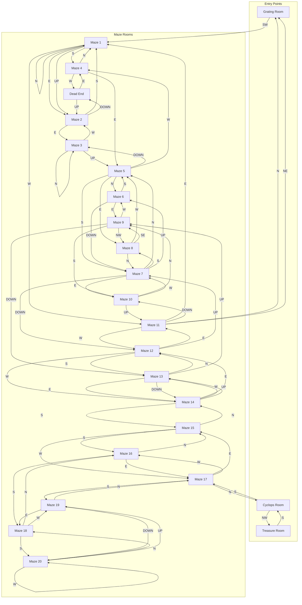

```mermaid
graph TD
      subgraph "Entry Points"
          GR[Grating Room]
          CR[Cyclops Room]
          TR[Treasure Room]
      end

      subgraph "Maze Rooms"
          M1[Maze 1]
          M2[Maze 2]
          M3[Maze 3]
          M4[Maze 4]
          M5[Maze 5]
          M6[Maze 6]
          M7[Maze 7]
          M8[Maze 8]
          M9[Maze 9]
          M10[Maze 10]
          M11[Maze 11]
          M12[Maze 12]
          M13[Maze 13]
          M14[Maze 14]
          M15[Maze 15]
          M16[Maze 16]
          M17[Maze 17]
          M18[Maze 18]
          M19[Maze 19]
          M20[Maze 20]
          DE[Dead End]
      end

      %% Grating Room
      GR -->|SW| M1

      %% Maze 1 - has N loop
      M1 -->|N| M1
      M1 -->|S| M4
      M1 -->|E| M2
      M1 -->|W| M11
      M1 -->|UP| M2

      %% Maze 2
      M2 -->|S| M1
      M2 -->|E| M3
      M2 -->|DOWN| DE

      %% Maze 3 - has N loop
      M3 -->|N| M3
      M3 -->|W| M2
      M3 -->|UP| M5

      %% Maze 4
      M4 -->|N| M1
      M4 -->|W| DE
      M4 -->|E| M5

      %% Maze 5 - junction
      M5 -->|N| M6
      M5 -->|S| M7
      M5 -->|E| M8
      M5 -->|DOWN| M3
      M5 -->|W| M4

      %% Maze 6
      M6 -->|S| M5
      M6 -->|E| M9
      M6 -->|DOWN| M7

      %% Maze 7
      M7 -->|N| M5
      M7 -->|S| M8
      M7 -->|E| M10
      M7 -->|UP| M6
      M7 -->|DOWN| M12

      %% Maze 8
      M8 -->|N| M7
      M8 -->|W| M5
      M8 -->|SE| M9

      %% Maze 9
      M9 -->|NW| M8
      M9 -->|W| M6
      M9 -->|S| M10
      M9 -->|DOWN| M13

      %% Maze 10
      M10 -->|N| M9
      M10 -->|W| M7
      M10 -->|UP| M11

      %% Maze 11
      M11 -->|N| GR
      M11 -->|E| M1
      M11 -->|DOWN| M10
      M11 -->|NE| GR
      M11 -->|W| M12

      %% Maze 12
      M12 -->|E| M11
      M12 -->|UP| M7
      M12 -->|S| M13
      M12 -->|W| M14

      %% Maze 13
      M13 -->|N| M12
      M13 -->|UP| M9
      M13 -->|E| M14
      M13 -->|DOWN| M14

      %% Maze 14
      M14 -->|E| M12
      M14 -->|W| M13
      M14 -->|UP| M13
      M14 -->|S| M15

      %% Maze 15
      M15 -->|N| M14
      M15 -->|S| M16
      M15 -->|W| M17

      %% Maze 16
      M16 -->|N| M15
      M16 -->|E| M17
      M16 -->|S| M18

      %% Maze 17 - near Cyclops
      M17 -->|E| M15
      M17 -->|W| M16
      M17 -->|S| M19
      M17 -->|N| CR

      %% Maze 18
      M18 -->|N| M16
      M18 -->|W| M19
      M18 -->|S| M20

      %% Maze 19
      M19 -->|N| M17
      M19 -->|E| M18
      M19 -->|DOWN| M20

      %% Maze 20 - has W loop
      M20 -->|N| M18
      M20 -->|UP| M19
      M20 -->|W| M20

      %% Dead End
      DE -->|E| M4
      DE -->|UP| M2

      %% Cyclops Room
      CR -->|S| M17
      CR -->|NW| TR

      %% Treasure Room
      TR -->|S| CR
```
