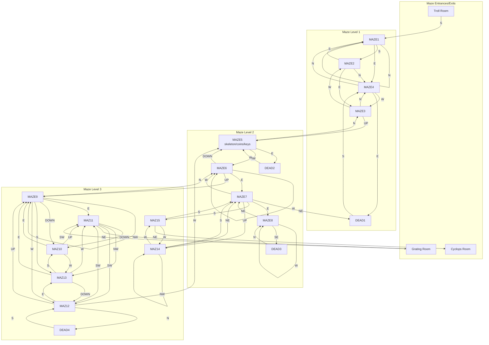

# Twisty Maze Map

"This is part of a maze of twisty little passages, all alike."

## Mermaid Diagram

## Key Information

### Entry Point
- **South from Troll Room** → MAZE1

### Exit Points
- **MAZ11 → Grating Room** (NE) - leads up to the clearing
- **MAZ15 → Cyclops Room** (NE)

### Treasure Location
- **MAZE5** contains:
  - Skeleton
  - Bag of coins
  - Set of keys
  - Broken lantern
  - Rusty knife

### Self-Loops (same room)
| Room | Direction |
|------|-----------|
| MAZE1 | N |
| MAZE6 | W |
| MAZE8 | W |
| MAZE9 | NW |
| MAZ14 | NW |

### Dead Ends
| Dead End | Return Direction | Connects To |
|----------|------------------|-------------|
| DEAD1 | S | MAZE4 |
| DEAD2 | W | MAZE5 |
| DEAD3 | N | MAZE8 |
| DEAD4 | S | MAZ12 |

## Room Connections Table

| Room | N | S | E | W | NE | NW | SE | SW | UP | DOWN |
|------|---|---|---|---|----|----|----|----|----|----|
| MAZE1 | MAZE1 | MAZE2 | MAZE4 | MTROL | - | - | - | - | - | - |
| MAZE2 | MAZE4 | MAZE1 | MAZE3 | - | - | - | - | - | - | - |
| MAZE3 | MAZE4 | - | - | MAZE2 | - | - | - | - | MAZE5 | - |
| MAZE4 | MAZE1 | - | DEAD1 | MAZE3 | - | - | - | - | - | - |
| MAZE5 | MAZE3 | - | DEAD2 | - | - | - | - | MAZE6 | - | - |
| MAZE6 | - | - | MAZE7 | MAZE6 | - | - | - | - | MAZE9 | MAZE5 |
| MAZE7 | - | MAZ15 | MAZE8 | MAZE6 | DEAD1 | - | - | - | MAZ14 | - |
| MAZE8 | - | - | - | MAZE8 | MAZE7 | - | DEAD3 | - | - | - |
| MAZE9 | MAZE6 | MAZ13 | MAZ11 | MAZ12 | - | MAZE9 | - | - | - | MAZ10 |
| MAZ10 | - | - | MAZE9 | MAZ13 | - | - | - | - | MAZ11 | - |
| MAZ11 | - | - | - | - | MGRAT | MAZ13 | - | MAZ12 | - | MAZ10 |
| MAZ12 | DEAD4 | - | MAZ13 | MAZE5 | - | - | - | MAZ11 | MAZE9 | - |
| MAZ13 | - | MAZ10 | MAZE9 | MAZ11 | - | - | - | - | - | MAZ12 |
| MAZ14 | - | MAZE7 | - | MAZ15 | MAZE7 | MAZ14 | - | - | - | - |
| MAZ15 | - | MAZE7 | - | MAZ14 | CYCLO | - | - | - | - | - |

## Source
Extracted from `docs/dungeon-81/mdlzork_810722/patched_confusion/dung.mud`
