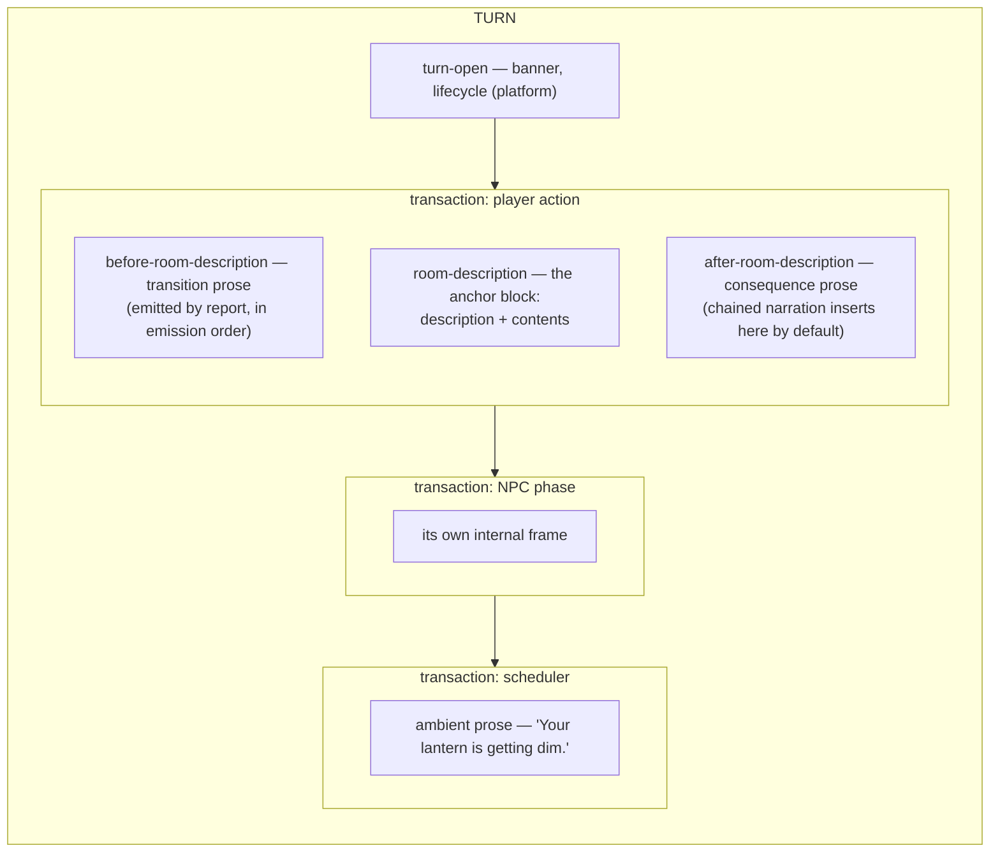

# Turn narrative slots — the prose-order seam, solved as a frame

Design session 2026-08-02 (session f081ec, ~1 AM, David + Claude). Input: David's
five-slot frame — "a turn has an order to it, report has an order to it: before
everything, before room description, room description, after room description,
after everything." This document works the frame against every real scenario from
the #207/#208 investigation and the three ADR-296 review rounds, and is the source
material for the next rewrite of ADR-296.

## 0. Vocabulary (David, in-session)

**Chord emits phrases.** A phrase — a messageId plus params, rendered by the language
layer — is the narration primitive. The slot frame places *phrase emissions*; that is
the whole job. A TS story's `game.message`-with-messageId is the same primitive in
ad-hoc clothing (dungeo's carousel entry message), and `chord.phrase` is its typed
form. The design below should be read as: sources emit phrases; transactions order
sources; slots place a phrase within its transaction's frame.

## 1. The model

Two nested orders, each owning what it can actually know:

- **Between sources**: a turn is a sequence of TRANSACTIONS in occurrence order —
  the player action, then each plugin batch (NPC phase, state machines, scheduler),
  per the ADR-120 priority loop. (Round-two result: engine stamps a transaction id
  per source at its two funnels.)
- **Within a transaction**: David's slot frame. The transaction's own emission
  stream already realizes it (actions emit transition prose, then the description,
  then contents — ADR-051 report order). Cross-mechanism contributions (chained
  narration) DECLARE a slot and are inserted at the frame boundary, because their
  stream position is an accident of dispatch (round-three finding).



Slot names (no abbreviations): `beforeEverything` (platform: lifecycle only),
`beforeRoomDescription`, `roomDescription` (the anchor — never declared, identified
by event type), `afterRoomDescription`, `afterEverything` (transaction-final).
For a transaction with no room-description anchor (a TAKE turn), the anchor is the
transaction's primary report event, and slots 2/4 collapse around it; `afterEverything`
remains transaction-final either way.

## 2. Who places what (defaults; nobody is forced to think about this)

| Contributor | Placement | Mechanism |
|---|---|---|
| Banner / lifecycle | turn-open | existing sort fixture (kept) |
| Implicit take | first inside the action transaction | existing prepend convention + sort fixture (kept) |
| Action `report()` prose | wherever emitted — the stream IS slots 2→3→4 | no change, no declaration |
| ADR-295 resolver narration | wherever the action forwards it (before the description) | no change — slot 2 by emission |
| **Chained narration** | **declared slot; default `afterRoomDescription`** | NEW: slot declaration on the chain, sorter inserts at the anchor boundary |
| Interceptor / capability effects | inside their action's stream, where the lifecycle emits them | no change |
| NPC phase, scheduler, state machines | own transactions, appended in plugin-priority order | round-two stamping |
| Sound dispatch, meta paths | unstamped → never grouped, stable order | round-two D3 never-group rule |

Proposed author surface (Chord derives from it later, per the ADR-293 posture):

```typescript
world.chainEvent('if.event.actor_moved', handler, {
  key: 'dungeo.carousel.entry-message',
  slot: 'afterRoomDescription',          // default — shown for clarity
});
```

The slot rides the chain REGISTRATION (author intent), is stamped onto the produced
events at dispatch (like depth/provenance today), and is consumed by the sorter's
insertion pass. Per-event override of the registration default is possible but not
proposed until a scenario needs it.

## 3. The ADR-106 decision, restated

Round-three blocker: chain-produced `game.message` events are consumed as messageId
OVERRIDES on their trigger (event-processor ADR-106 path) and never reach the sorter.
Under the slot model the decision is:

**A chain handler's returned narration becomes standalone, slot-placed events.**
Override consumption no longer applies to chain-produced messages. Overrides remain
what they were designed for (entity-handler message replacement).

**Audit COMPLETE (2026-08-02 ~01:30, in-session): the retirement is effectively free.**
Full census of chain handlers in the tree, per the stdlib migration-audit rule
(enumerate emissions AND what dispatch did with them):

- **Chord event clauses** (story-loader `bindEventClause` → `execStatements`): Chord
  has no `say` keyword — narration is a `phrase` statement (a quoted line or named
  phrase key in a clause body, IRStatement kind `'phrase'`), produced as typed
  `chord.phrase` events (`runtime.ts:2166`), NOT `game.message`. Chained phrases ride
  as standalone reaction events already; never override-consumed. (Chord's `on`
  interceptor clauses DO override — deliberately, via the lifecycle engine's
  `InterceptorReportResult.override`, "a hit fully owns the response, override never
  append" — a different, explicit surface untouched by this design.)
- **stdlib standard chains**: one exists — opened → `if.event.revealed`, a typed
  event with its own prose handler. Never override-consumed.
- **family-zoo**: scoring chains return `null`; dynamic-text chains return typed
  `zoo.event.gate_status` / `zoo.event.parrot_flavor`. Never override-consumed.
- **dungeo carousel entry message** (added yesterday, ADR-295): the ONE
  chain-produced `game.message` in the tree. Today it renders after the description
  only via override-onto-`actor_moved` plus the hoist; under slot semantics it
  renders after the description as a standalone slot-4 event — **identical visible
  output**, by contract instead of by accident.

**Round-four extension** (the chain-only census above was too narrow): the
`registerHandler` → `message`-effect class is override-consumed on the same path.
Dungeo census: treasure-room scream (messageless trigger → phrase emission under the
D4 partition, golden position preserved by contract), mirror-room rumble (trigger has
messageId → genuine override, unchanged), death-penalty (one message effect —
classified at implementation under the same partition; no description anchor in death
turns). Final tally: two phrase-emission dependents, both rendering at their current
positions by contract; one genuine override, untouched. Entity-handler replacement
(ADR-106's actual use case) survives exactly where a message exists to replace.

## 4. Scenarios — every real case from tonight, walked

Legend: emission position → rendered position under the slot model; Δ marks a change
from today's shipped goldens.

### S1. Plain movement (no chains, no carousel)
`> north` → [movement events][description][contents]. One transaction, stream order.
Rendered identically to today. No Δ.

### S2. Carousel bearings + entry message (wt-10, the #207/#295 turn)
- Resolver narration "You cannot get your bearings..." — forwarded by going's report
  BEFORE the description → slot 2. **Δ: moves above the description** (MDL order;
  today's hoist wrongly sinks it below).
- Entry message "As you enter, your compass starts spinning wildly." — chained off
  `actor_moved`, default slot 4 → inserted after description+contents. **No Δ —
  today's golden position, which the flat-order draft broke.**

### S3. Trap on entry (ADR-094's founding example, currently hypothetical)
Chain on `actor_moved` returns "A trap door bangs shut!" → slot 4. Walk in, read the
room, then the trap. The ADR-094 authorial promise, delivered for the first time.

### S4. Thief scream (wt-13) — CORRECTED in round-four review
NOT a chain: `treasure-room-handler.ts:27` registers via `eventProcessor.registerHandler`
and returns a `message` EFFECT, override-consumed onto messageless `actor_moved`
(narration hack — its after-description position today is pure hoist accident).
Under ADR-296 D4's partition (override requires an existing messageId), it becomes a
standalone phrase emission → slot 4 default → after Treasure Room's description.
No Δ from today's golden — now by contract. (Contrast mirror-room: its rumble
overrides `touched`, which HAS a messageId — genuine replacement, unchanged.)

### S5. Walk-through curtain (wt-02, bank puzzle)
"You feel somewhat disoriented..." emitted by the story action's report before its
description → slot 2. **Δ: moves above the description** — undoing the hoist's
damage. (This is the diff that proved the hoist harmful in round one.)

### S6. Royal-puzzle climb line (wt-14)
Same shape as S5 — report-emitted transition prose. **Δ: moves above the description.**

### S7. Endgame wait turn (wt-17)
`> wait` action transaction ("Time passes...") then the endgame handler's transaction
(figure appears; teleport; its own room description). Transactions concatenate;
each keeps its internal frame. **Δ: the daemon's room description stops hoisting
above the wait message.** The daemon's own prose order is its emission order.

### S8. Implicit take (`> read leaflet` while it's on the ground)
"(first taking the leaflet)" prepended by convention + kept sort fixture → first in
the action transaction. No Δ. (Round-one lesson: required feature, doubly guaranteed.)

### S9. Blocked movement (ADR-295 blocked resolution, or too_dark)
No description anchor is emitted; the blocked message is the primary event; chained
narration (if any) lands after it. No Δ.

### S10. Non-movement turn with a chained reaction (`> put coal in machine`,
machine chain returns "The machine shudders to life.")
No room-description anchor → anchor is the action's primary report event
("You put the coal in the machine.") → chain's slot 4 renders after it. Natural.

### S11. Ambient daemon (`lantern dim` fuse)
Scheduler transaction, appended last → "after everything" by position. No Δ.

### S12. NPC combat turn (thief attacks after your action)
NPC-phase transaction after the action transaction. No Δ (this is already today's
order; round-two stamping makes it principled instead of positional).

## 5. What dies, what lives

| Mechanism | Fate |
|---|---|
| `_transactionId` origin stamping | BUILT (round-two design, unchanged: two funnels) |
| `executeChains` inheritance | kept; wording honesty from round three applies (stamping happens at the funnel) |
| Room-description hoist | DELETED (proven harmful; replaced by the anchor role) |
| `action.*` hoist | DELETED (no contract behind it) |
| Chain-depth comparator | DELETED — slot declaration is what depth was groping at; ADR-094 Amendment A1 gains a paragraph saying so |
| Lifecycle-first, implicit-take-first | KEPT (fixtures) |
| ADR-106 override for chain messages | RETIRED for chains after the §3 audit; overrides otherwise untouched |
| Missing-id never-groups | KEPT (round-two D3; closes #208's defect class permanently) |

## 6. Open questions for the ADR rewrite

- **Q-A: anchor-end semantics.** "After room description" must mean after the
  description AND its contents listing (`if.event.list.contents` trails the
  description in going's report). Proposed: the anchor is the description event plus
  contiguous contents events; slot-4 insertion point is after that cluster. Needs a
  precise event-type list.
- **Q-B: slot vocabulary at the wire.** Slot stamped into event data (serializes into
  the event-source save stream — the round-three save-file finding applies to slots
  exactly as to transaction ids; version note per the save-format convention).
- **Q-C: is `beforeRoomDescription` chain-reachable?** Scenario S2's bearings is
  report-emitted, not chained. Is there an authorial case for a chain declaring
  slot 2 ("narrate my reaction before the player sees the room")? Default no until a
  scenario demands it — but the registration option costs nothing to allow.
- **Q-D: multiple room descriptions in one transaction.** ADR-295 killed the known
  case (one traversal, one arrival). LOOK emits one. Treat a second same-transaction
  description as a defect (warn), first one anchors.
- ~~Q-E: the §3 override audit result~~ — RESOLVED in-session, see §3: one dependent
  (dungeo's own entry message), identical output under the new semantics.

## 7. Status

Model agreed in-session as the basis for rewriting ADR-296 (pending David's read of
this document). The rewrite folds: round-two stamping (funnels, never-group),
round-three corrections (save-file impact, module paths, inheritance wording,
data-absent stamping, plugin-funnel tests), this frame (slots, anchor, chain
declaration, ADR-106 retirement for chains), and the §4 scenario table as the
acceptance basis — every golden diff must map to a Δ predicted here.
