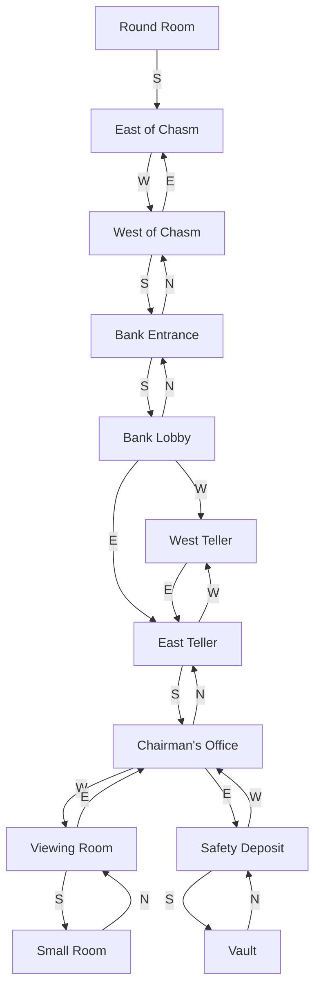
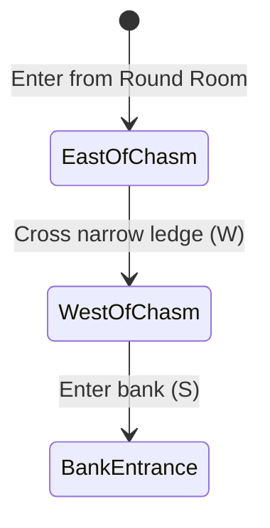
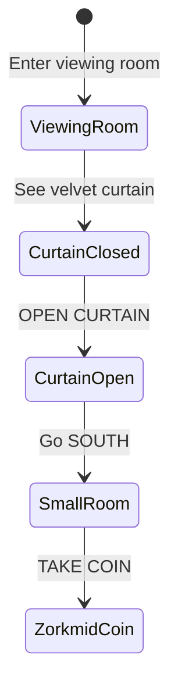

# Bank of Zork Region

The famous Bank of Zork, one of the GUE's premier financial institutions. Accessed from the Round Room via a treacherous chasm crossing.

## Room Connections

## Rooms

| Room | File | Key Features |
|------|------|--------------|
| East of Chasm | [east-of-chasm.ts](./rooms/east-of-chasm.ts) | Entry from Round Room, chasm edge |
| West of Chasm | [west-of-chasm.ts](./rooms/west-of-chasm.ts) | Other side of chasm, bank access |
| Bank Entrance | [bank-entrance.ts](./rooms/bank-entrance.ts) | Grand marble entrance hall |
| Bank Lobby | [bank-lobby.ts](./rooms/bank-lobby.ts) | Main hall, teller windows |
| West Teller | [west-teller.ts](./rooms/west-teller.ts) | Behind west teller window |
| East Teller | [east-teller.ts](./rooms/east-teller.ts) | Behind east teller window |
| Chairman's Office | [chairmans-office.ts](./rooms/chairmans-office.ts) | Portrait, mahogany desk |
| Viewing Room | [viewing-room.ts](./rooms/viewing-room.ts) | Velvet curtain puzzle |
| Small Room | [small-room.ts](./rooms/small-room.ts) | Behind the curtain, zorkmid coin |
| Safety Deposit | [safety-deposit.ts](./rooms/safety-deposit.ts) | Rows of deposit boxes, vault door |
| Vault | [vault.ts](./rooms/vault.ts) | Main vault, zorkmid bills |

## Objects

| Object | Location | Purpose |
|--------|----------|---------|
| Portrait | Chairman's Office | Treasure (10 points) |
| Stack of zorkmid bills | Vault | Treasure (15 points) |
| Zorkmid coin | Small Room | Treasure (5 points) |
| Velvet curtain | Viewing Room | Scenery, openable |
| Mahogany desk | Chairman's Office | Scenery |
| Brass plaque | Bank Entrance | Scenery |
| Vault door | Safety Deposit | Scenery, already open |

## Key Puzzles

### 1. Chasm Crossing

The narrow ledge along the north wall provides passage across the chasm. In the original Zork, this required balancing, but for now it's passable.

### 2. Curtain Discovery

The velvet curtain hides the Small Room where a zorkmid coin lies forgotten.

### 3. Vault Access

The vault door stands ajar, its locking mechanism broken by time. Simply walk south from the Safety Deposit Area.

## Original Zork Notes

In the original Zork/Dungeon, the Bank of Zork had a more complex puzzle involving:
- A combination lock on the vault
- Teller windows that could be approached from either side
- A more elaborate viewing room puzzle

This implementation simplifies some mechanics while preserving the essential layout and treasures.

## Implementation Status

- [x] Room geometry and connections
- [x] Basic objects placed
- [x] Treasure values assigned
- [ ] Chasm crossing danger (balance check)
- [ ] Curtain open/close affecting movement
- [ ] Vault puzzle mechanics
