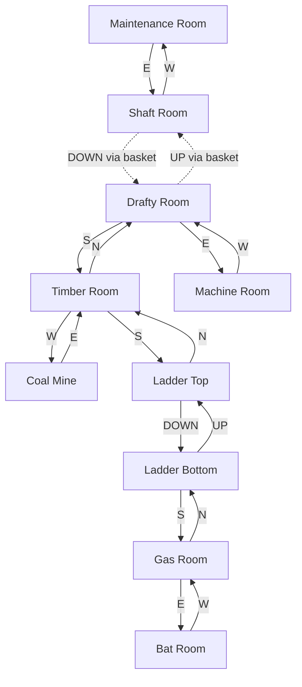
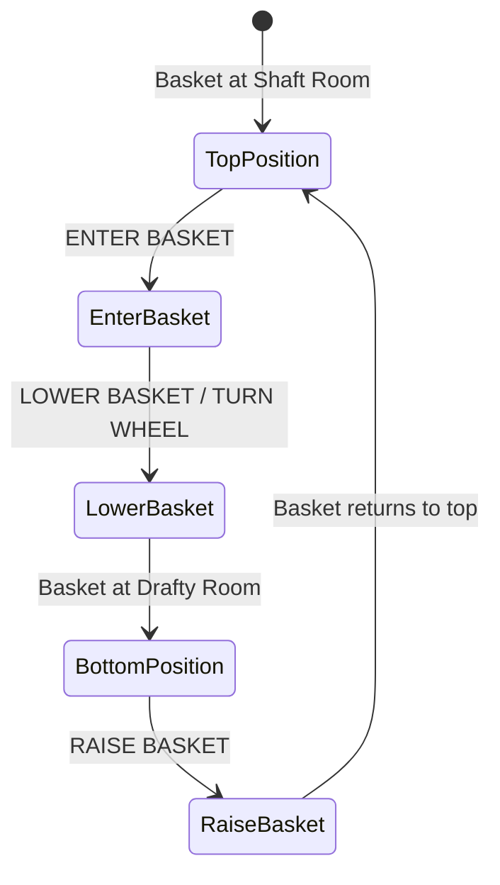
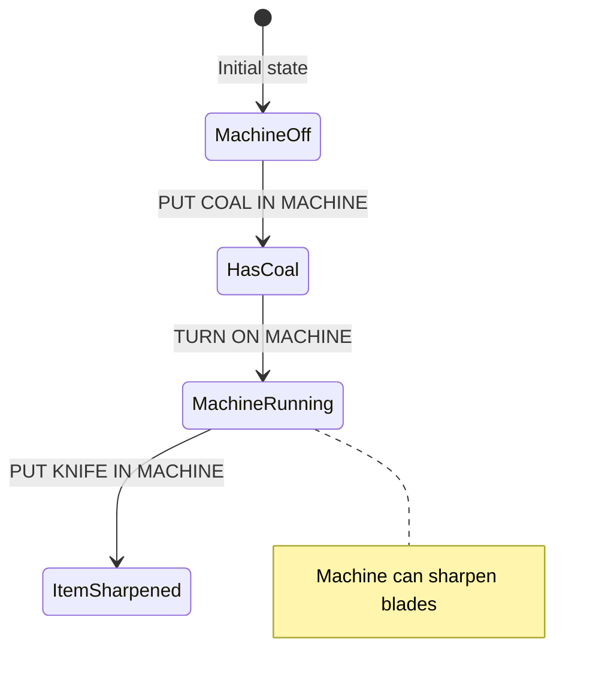

# Coal Mine Region

Deep underground mining area accessed from the Dam's Maintenance Room. Features the basket elevator, coal-powered machine, and the vampire bat.

## Room Connections

## Rooms

| Room | File | Key Features |
|------|------|--------------|
| Shaft Room | [shaft-room.ts](./rooms/shaft-room.ts) | Top of basket elevator |
| Drafty Room | [drafty-room.ts](./rooms/drafty-room.ts) | Bottom of basket elevator |
| Machine Room | [machine-room.ts](./rooms/machine-room.ts) | Coal-powered machine |
| Coal Mine | [coal-mine.ts](./rooms/coal-mine.ts) | Source of coal |
| Timber Room | [timber-room.ts](./rooms/timber-room.ts) | Mining supports |
| Ladder Top | [ladder-top.ts](./rooms/ladder-top.ts) | Top of wooden ladder |
| Ladder Bottom | [ladder-bottom.ts](./rooms/ladder-bottom.ts) | Bottom of ladder |
| Gas Room | [gas-room.ts](./rooms/gas-room.ts) | Dangerous flammable gas |
| Bat Room | [bat-room.ts](./rooms/bat-room.ts) | Vampire bat lair |

## Objects

| Object | Location | Purpose |
|--------|----------|---------|
| Rusty basket | Shaft Room | Elevator mechanism |
| Coal | Coal Mine | Fuel for machine |
| Machine | Machine Room | Sharpens items when powered |
| Vampire bat | Bat Room | NPC, carries player (repelled by garlic) |
| Jade figurine | Bat Room | Treasure (5 points) |
| Sapphire bracelet | Gas Room | Treasure (5 points) |

## Key Puzzles

### 1. Basket Elevator

The basket is the only way to traverse the shaft. Must enter basket first, then operate the wheel.

### 2. Coal-Powered Machine

Get coal from the Coal Mine, put it in the machine, activate it, then insert items to sharpen them.

### 3. Gas Room Danger

The Gas Room contains flammable gas. Bringing an open flame (lit lantern, torch, etc.) into this room causes an explosion!

### 4. Vampire Bat

The vampire bat will grab the player and carry them to a random location unless the player is carrying garlic (found in the kitchen sack).

## Original Zork Notes

The coal mine area was one of the puzzle hubs in original Zork. The basket elevator was a precursor to vehicle mechanics. The machine puzzle taught players about item transformation. The vampire bat was an early example of an NPC that could interact with the player in unexpected ways.

## Implementation Status

- [x] Room geometry and connections
- [x] Basic objects placed
- [x] Treasures with scoring
- [x] Connection to Dam region
- [ ] Basket elevator mechanics
- [ ] Machine puzzle logic
- [ ] Gas room explosion on open flame
- [ ] Vampire bat behavior (grab and carry)
- [ ] Garlic repels bat
