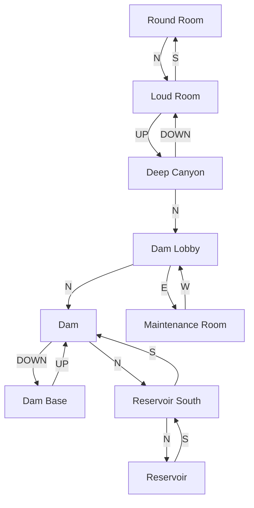
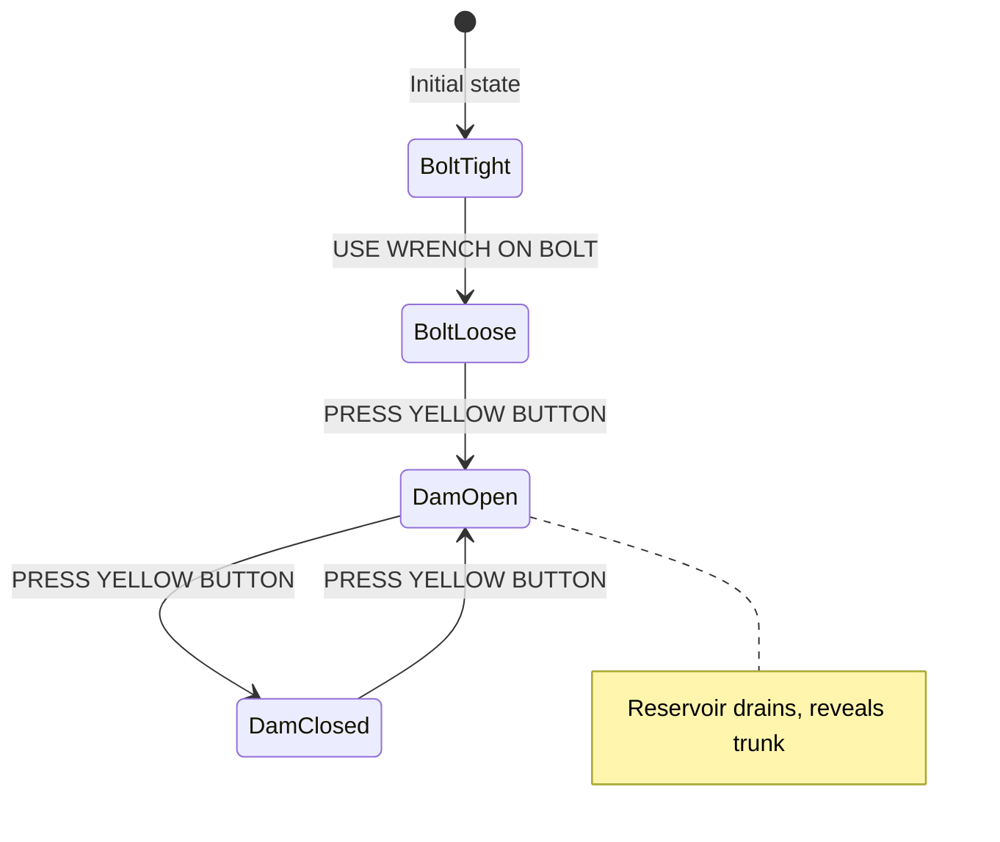

# Dam Region

Flood Control Dam #3 and surrounding areas. This region is accessed from the Round Room via the Loud Room.

## Room Connections

## Rooms

| Room | File | Key Features |
|------|------|--------------|
| Loud Room | [loud-room.ts](./rooms/loud-room.ts) | Echo puzzle |
| Deep Canyon | [deep-canyon.ts](./rooms/deep-canyon.ts) | Overlook, rushing water sounds |
| Dam Lobby | [dam-lobby.ts](./rooms/dam-lobby.ts) | Waiting area, guidebook |
| Flood Control Dam #3 | [dam.ts](./rooms/dam.ts) | Top of dam, outdoors |
| Dam Base | [dam-base.ts](./rooms/dam-base.ts) | Below dam, river access |
| Maintenance Room | [maintenance-room.ts](./rooms/maintenance-room.ts) | Control panel, tools |
| Reservoir South | [reservoir-south.ts](./rooms/reservoir-south.ts) | Shore access |
| Reservoir | [reservoir.ts](./rooms/reservoir.ts) | Trunk of jewels (when drained) |

## Objects

| Object | Location | Purpose |
|--------|----------|---------|
| Platinum Bar | Loud Room | Treasure (10 points), heavy |
| Guidebook | Dam Lobby | Explains dam history and controls |
| Control Panel | Maintenance Room | Opens/closes sluice gates |
| Wrench | Maintenance Room | Loosens bolt on panel |
| Screwdriver | Maintenance Room | General tool |
| Trunk of Jewels | Reservoir | Treasure (15 points) |

## Key Puzzles

### 1. Loud Room Echo
Don't say "echo" without protection. See [loud-room.md](./rooms/loud-room.md).

### 2. Dam Controls

### 3. Reservoir Access
- Dam must be opened to drain reservoir
- Once drained, player can walk into reservoir
- Trunk of jewels revealed in mud

## Original Zork Notes

In the original Zork/Dungeon, this area was one of the main puzzle hubs. The dam controls affected water levels throughout the underground river system, which impacted boat navigation in later areas.

## Implementation Status

- [x] Room geometry and connections
- [x] Basic objects placed
- [ ] Dam control puzzle logic
- [ ] Loud Room echo puzzle
- [ ] Reservoir state (full vs drained)
- [ ] Water level affects on other areas
