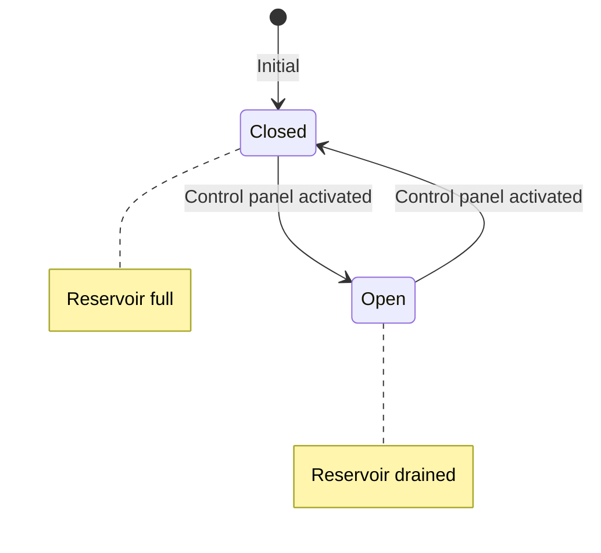

# Flood Control Dam #3

## Original Zork Description

> "You are standing on the top of Flood Control Dam #3, which was quite a tourist attraction in times far distant. There are paths to the north, south, and down."

## Connections

| Direction | Destination | Notes |
|-----------|-------------|-------|
| SOUTH | Dam Lobby | Back inside |
| DOWN | Dam Base | Below the dam |
| NORTH | Reservoir South | Toward reservoir |

## Dam State

The dam has a `damOpen` flag that tracks whether the sluice gates are open.

## Effects of Dam State

| State | Reservoir | River | Trunk |
|-------|-----------|-------|-------|
| Closed | Full (need boat) | Normal flow | Submerged |
| Open | Drained (walkable) | Reduced flow | Accessible |

## Implementation Notes

- `damOpen` boolean on room entity
- Changing state should emit events for:
  - Reservoir description change
  - Trunk accessibility
  - River flow changes (Phase 3)
