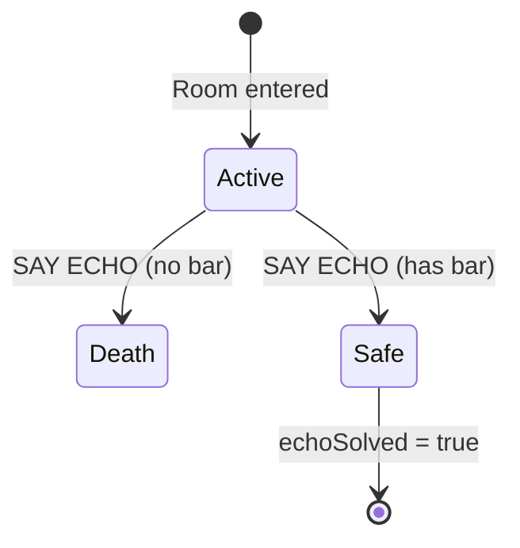

# Loud Room

## Original Zork Description

> "This is a large room with a ceiling which cannot be detected from the ground. There is a narrow passage from east to west and a stone stairway leading upward."

## Connections

| Direction | Destination | Notes |
|-----------|-------------|-------|
| SOUTH | Round Room | Back to hub |
| UP | Deep Canyon | Toward dam |

## The Echo Puzzle

The Loud Room has unusual acoustics that amplify sound dramatically.

### Danger: Saying "ECHO"

```
> ECHO
The acoustics of the room cause your voice to echo back with increasing volume.
The reverberations are deafening!
CRASH! The room collapses around you!

    *** You have died ***
```

### Solution: The Platinum Bar

Carrying the platinum bar absorbs the sound waves:

```
> ECHO  (while carrying platinum bar)
The platinum bar seems to absorb the sound, preventing dangerous reverberations.
The acoustics of the room cause your voice to echo: "echo...echo...echo..."
```

## State Machine



## Implementation Notes

- Custom handler for SAY/SHOUT actions
- Check player inventory for platinum bar
- `echoSolved` flag prevents repeat deaths after solving

## Transcript Test

See `stories/dungeo/tests/transcripts/loud-room-echo.transcript` (TODO)
