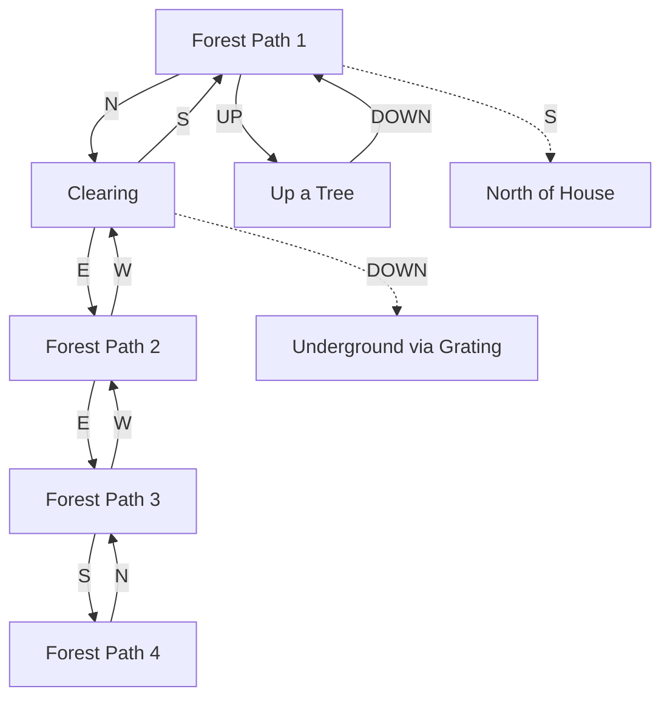
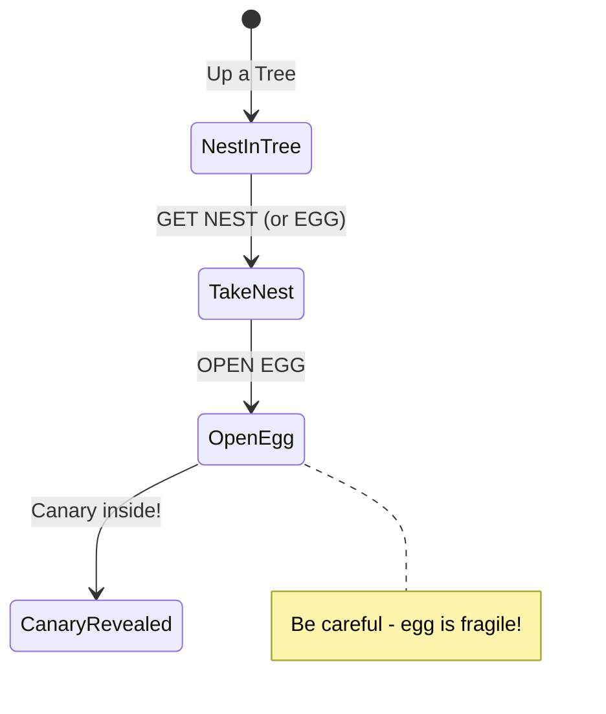

# Forest Region

The forest surrounding the white house. Contains winding paths, a clearing with a grating to the underground, and a climbable tree with the first treasure.

## Room Connections

## Rooms

| Room | File | Key Features |
|------|------|--------------|
| Forest Path 1 | [forest-path-1.ts](./rooms/forest-path-1.ts) | Large tree, connects to house |
| Forest Path 2 | [forest-path-2.ts](./rooms/forest-path-2.ts) | Dense forest |
| Forest Path 3 | [forest-path-3.ts](./rooms/forest-path-3.ts) | Forest continues |
| Forest Path 4 | [forest-path-4.ts](./rooms/forest-path-4.ts) | Near maze edge |
| Clearing | [clearing.ts](./rooms/clearing.ts) | Grating to underground |
| Up a Tree | [up-a-tree.ts](./rooms/up-a-tree.ts) | Bird's nest with egg |

## Objects

| Object | Location | Purpose |
|--------|----------|---------|
| Large tree | Forest Path 1 | Scenery, can climb |
| Pile of leaves | Clearing | Scenery |
| Grating | Clearing | Leads underground (locked) |
| Bird's nest | Up a Tree | Container, holds egg |
| Jewel-encrusted egg | In nest | Treasure (5 pts), contains canary |
| Golden clockwork canary | In egg | Treasure (6 pts), fragile |

## Key Puzzles

### 1. Climbing the Tree

Go UP from Forest Path 1 to reach the tree branch with the nest.

### 2. The Egg and Canary

The jewel-encrusted egg is a treasure itself, and contains the golden clockwork canary inside. Both need to be placed in the trophy case for full points.

### 3. Grating Access

The grating leads to the underground but requires a key found elsewhere.

## Original Zork Notes

The forest in original Zork was designed to feel confusing - many similar-looking paths that loop back on themselves. The clearing with the grating was a key landmark. The egg/canary puzzle taught players that treasures can contain other treasures.

## Implementation Status

- [x] Room geometry and connections
- [x] Basic objects placed
- [x] Tree climbing (UP/DOWN)
- [x] Nest and egg containers
- [x] Treasures marked for scoring
- [ ] Grating lock/key puzzle
- [ ] Canary fragility (breaks if dropped)
- [ ] Forest maze paths to other areas
