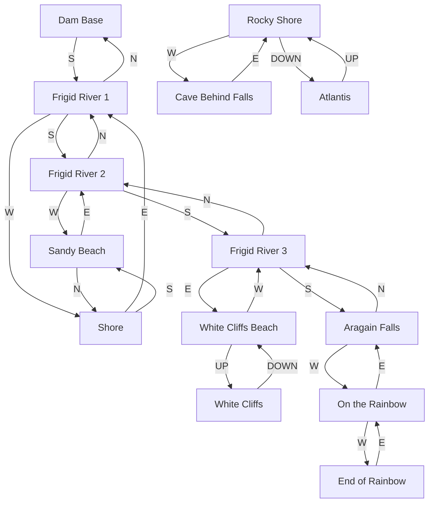
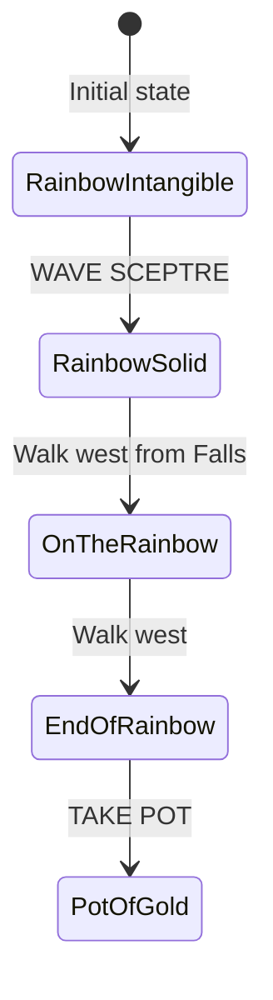

# Frigid River Region

The Frigid River flows from the Dam to the spectacular Aragain Falls. Features boat navigation, the rainbow puzzle, and the lost city of Atlantis.

## Room Connections

## Rooms

| Room | File | Key Features |
|------|------|--------------|
| Frigid River 1 | [frigid-river-1.ts](./rooms/frigid-river-1.ts) | Upper river, near dam |
| Frigid River 2 | [frigid-river-2.ts](./rooms/frigid-river-2.ts) | Middle river |
| Frigid River 3 | [frigid-river-3.ts](./rooms/frigid-river-3.ts) | Near falls, dangerous |
| Shore | [shore.ts](./rooms/shore.ts) | Western bank, boat access |
| Sandy Beach | [sandy-beach.ts](./rooms/sandy-beach.ts) | Buoy location |
| Aragain Falls | [aragain-falls.ts](./rooms/aragain-falls.ts) | Waterfall, rainbow |
| On the Rainbow | [on-the-rainbow.ts](./rooms/on-the-rainbow.ts) | Solid rainbow (sceptre) |
| End of Rainbow | [end-of-rainbow.ts](./rooms/end-of-rainbow.ts) | Pot of gold |
| White Cliffs Beach | [white-cliffs-beach.ts](./rooms/white-cliffs-beach.ts) | Base of cliffs |
| White Cliffs | [white-cliffs.ts](./rooms/white-cliffs.ts) | Cliff top viewpoint |
| Rocky Shore | [rocky-shore.ts](./rooms/rocky-shore.ts) | Below falls |
| Atlantis | [atlantis.ts](./rooms/atlantis.ts) | Underwater city, trident |
| Cave Behind Falls | [cave-behind-falls.ts](./rooms/cave-behind-falls.ts) | Hidden passage |

## Objects

| Object | Location | Purpose |
|--------|----------|---------|
| Pot of gold | End of Rainbow | Treasure (10 points) |
| Trident | Atlantis | Treasure (4 points) |
| Buoy (with emerald) | Sandy Beach | Container + Treasure (5 points) |
| Rainbow | Aragain Falls | Scenery, puzzle element |
| Waterfall | Aragain Falls | Scenery |
| Inflatable boat | Shore | Vehicle (mechanics pending) |

## Key Puzzles

### 1. Rainbow Puzzle

Wave the sceptre at the rainbow to make it solid and walkable.

### 2. River Navigation

The river flows south toward Aragain Falls. A boat is required to navigate the river. Going over the falls is fatal!

### 3. Atlantis Access

Dive down from Rocky Shore to reach the underwater city of Atlantis.

## Original Dungeon Notes

In the original Mainframe Dungeon, the river navigation required an inflatable boat and avoiding the falls. The rainbow puzzle was one of the most memorable in the game.

## Implementation Status

- [x] Room geometry and connections
- [x] Basic objects placed
- [x] Treasures assigned
- [ ] Boat/vehicle mechanics
- [ ] Rainbow solid/intangible state
- [ ] River current (auto-movement)
- [ ] Falls death trap
