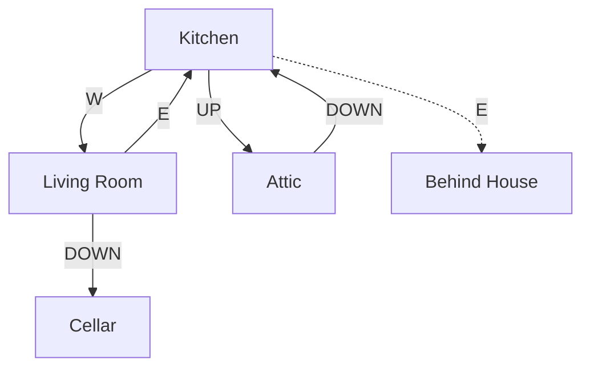
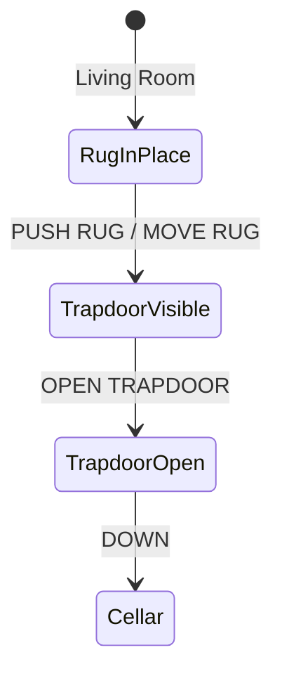

# House Interior Region

The inside of the white house. Contains essential starting equipment and the hidden entrance to the Great Underground Empire.

## Room Connections

## Rooms

| Room | File | Key Features |
|------|------|--------------|
| Kitchen | [kitchen.ts](./rooms/kitchen.ts) | Entry from window, supplies |
| Living Room | [living-room.ts](./rooms/living-room.ts) | Trophy case, hidden trapdoor |
| Attic | [attic.ts](./rooms/attic.ts) | Rope and knife |

## Objects

| Object | Location | Purpose |
|--------|----------|---------|
| Kitchen table | Kitchen | Scenery |
| Brown sack | Kitchen | Container, holds food/garlic |
| Lunch | In sack | Food item |
| Garlic | In sack | Wards off vampire |
| Glass bottle | Kitchen | Contains water |
| Water | In bottle | Needed for various puzzles |
| Trophy case | Living Room | Place treasures for points |
| Elvish sword | Living Room | Weapon, glows near danger |
| Brass lantern | Living Room | Light source (330 turns) |
| Oriental rug | Living Room | Hides trapdoor |
| Trapdoor | Under rug | Leads to cellar |
| Wooden door | Living Room | Scenery, nailed shut |
| Table | Attic | Scenery |
| Rope | Attic | Climbing tool |
| Nasty knife | Attic | Weapon (weaker than sword) |

## Key Puzzles

### 1. The Hidden Trapdoor

The oriental rug hides the trapdoor. Push the rug to reveal it, then open and descend.

### 2. Light Source Management

The brass lantern has 330 turns of fuel. The underground is dark - you need light to explore safely.

### 3. Trophy Case Scoring

Placing treasures in the trophy case awards points:

| Action | Points |
|--------|--------|
| Place treasure | Varies by treasure |
| Place all treasures | Bonus points |

## Original Zork Notes

The living room with its trophy case was the hub of the game's scoring system. The rug/trapdoor puzzle was one of the first examples of hidden exits in text adventures. The sword glowing blue near enemies was borrowed from Tolkien's Sting.

## Implementation Status

- [x] Room geometry and connections
- [x] Basic objects placed
- [x] Rug/trapdoor puzzle working
- [x] Trophy case container
- [x] Sword with weapon trait
- [x] Lantern with light source trait
- [x] Connection to cellar
- [ ] Sword glowing near danger
- [ ] Score display when treasure placed
- [ ] Nailed door message
