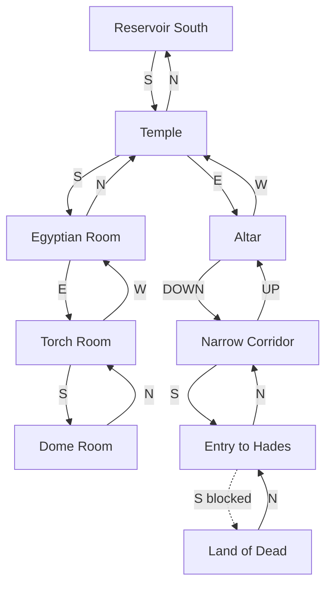
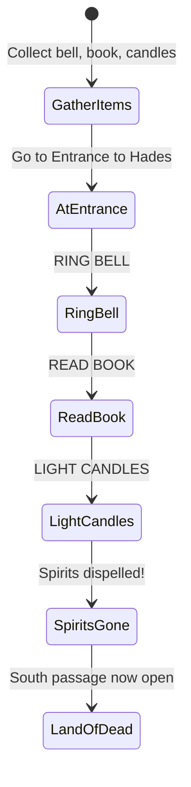
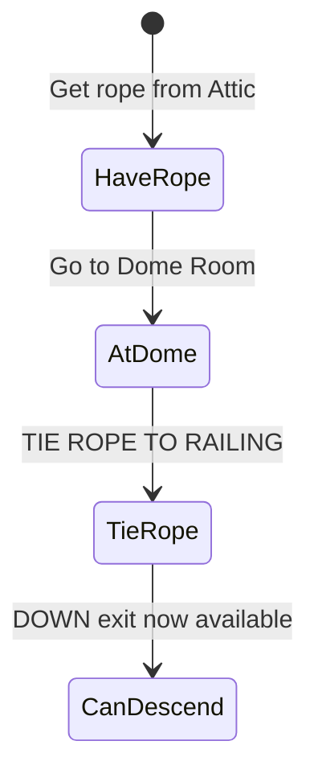

# Temple Region

Ancient temple area including Egyptian tomb and the gates of Hades. Features the famous bell/book/candle exorcism puzzle and several valuable treasures.

## Room Connections

## Rooms

| Room | File | Key Features |
|------|------|--------------|
| Temple | [temple.ts](./rooms/temple.ts) | Main entrance, hieroglyphics |
| Altar | [altar.ts](./rooms/altar.ts) | Stone altar, exorcism items |
| Egyptian Room | [egyptian-room.ts](./rooms/egyptian-room.ts) | Gold coffin with sceptre |
| Torch Room | [torch-room.ts](./rooms/torch-room.ts) | Ivory torch treasure |
| Dome Room | [dome-room.ts](./rooms/dome-room.ts) | Rope descent puzzle |
| Narrow Corridor | [narrow-corridor.ts](./rooms/narrow-corridor.ts) | Connects to Hades |
| Entrance to Hades | [entry-to-hades.ts](./rooms/entry-to-hades.ts) | Spirits block until exorcism |
| Land of the Dead | [land-of-dead.ts](./rooms/land-of-dead.ts) | Crystal skull, chalice |

## Objects

| Object | Location | Purpose |
|--------|----------|---------|
| Stone altar | Altar | Scenery, ritual site |
| Brass bell | Altar | Exorcism ritual item |
| Black book | Altar | Exorcism ritual item, readable |
| Pair of candles | Altar | Exorcism ritual item, treasure (5 pts) |
| Gold coffin | Egyptian Room | Treasure (10 pts), contains sceptre |
| Sceptre | In coffin | Treasure (4 pts), rainbow puzzle |
| Ivory torch | Torch Room | Treasure (6 pts), permanent light source |
| Crystal skull | Land of Dead | Treasure (10 pts) |
| Chalice | Land of Dead | Treasure (10 pts) |

## Key Puzzles

### 1. The Exorcism Ritual

The spirits blocking passage to the Land of the Dead can only be dispelled by performing the exorcism ritual in the correct order.

### 2. The Dome Room Rope Puzzle

The rope from the attic can be tied to the railing to descend into areas below.

### 3. The Coffin

Open the gold coffin to find the sceptre inside. Both are treasures.

## Original Zork Notes

The temple area was one of the most memorable puzzle hubs in original Zork. The exorcism puzzle taught players about combining items in a specific sequence. The Land of the Dead was protected by spirits that could not be defeated through combat - only ritual. The sceptre found here is later used to solidify the rainbow at Aragain Falls.

## Implementation Status

- [x] Room geometry and connections
- [x] Basic objects placed
- [x] Treasures with scoring (45 pts total)
- [x] Connection to Dam region
- [ ] Exorcism ritual logic
- [ ] Spirit blocking mechanics
- [ ] Rope tie/descend mechanics
- [ ] Candle lighting with matches
