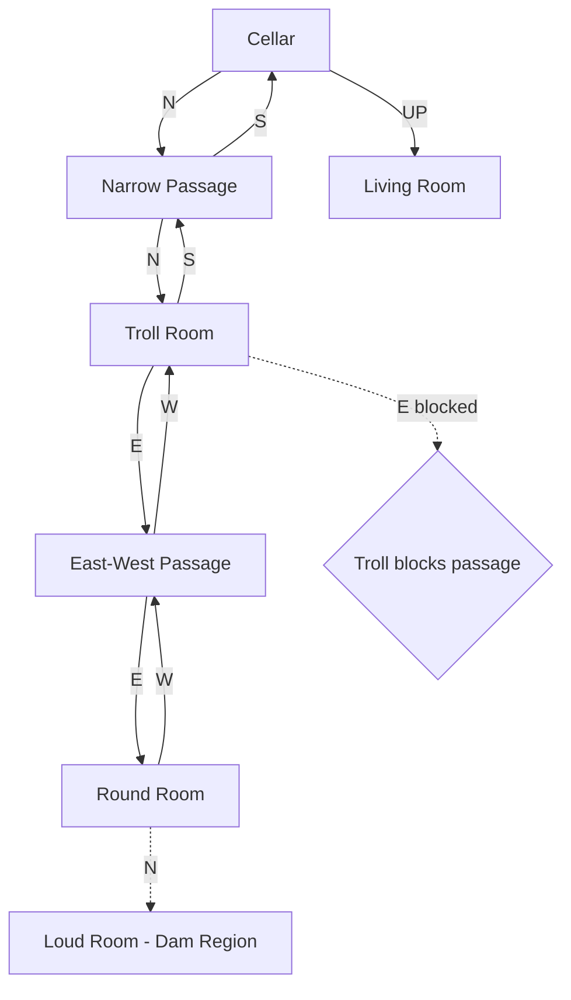
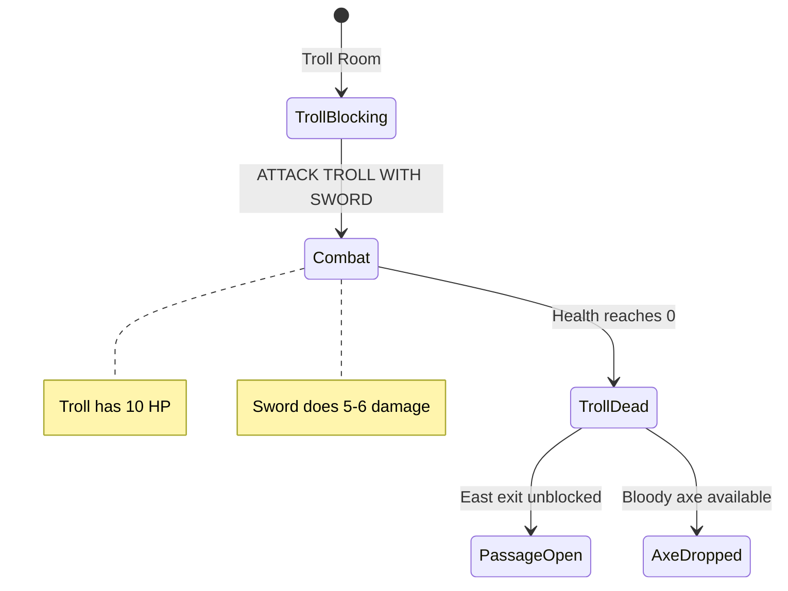

# Underground Region

The first underground area of the Great Underground Empire (GUE). Accessed through the trapdoor in the living room, this region introduces the troll combat encounter.

## Room Connections

## Rooms

| Room | File | Key Features |
|------|------|--------------|
| Cellar | [cellar.ts](./rooms/cellar.ts) | Dark, metal ramp |
| Narrow Passage | [narrow-passage.ts](./rooms/narrow-passage.ts) | Tight corridor |
| Troll Room | [troll-room.ts](./rooms/troll-room.ts) | Combat encounter |
| East-West Passage | [east-west-passage.ts](./rooms/east-west-passage.ts) | Connects to deeper areas |
| Round Room | [round-room.ts](./rooms/round-room.ts) | Hub room, leads to dam |

## Objects

| Object | Location | Purpose |
|--------|----------|---------|
| Metal ramp | Cellar | Scenery, too slippery to climb |
| Troll | Troll Room | NPC, blocks east passage |
| Bloody axe | With troll | Weapon, drops when troll killed |

## Key Puzzles

### 1. The Troll Encounter

The troll blocks passage east. Combat is the only solution:
- Troll has 10 HP
- Elvish sword does 5 base damage + bonus
- Troll can retaliate - be careful!
- Defeating troll awards 10 points

### 2. The Metal Ramp

The ramp prevents returning up to the living room by climbing. The only way out is through the trapdoor.

### 3. One-Way Descent

Once you go down the trapdoor, the ramp makes it impossible to climb back up. You must:
1. Keep the trapdoor open
2. Or find another exit (grating in clearing)

## Original Zork Notes

The troll was one of the first combat encounters in text adventures. The design forced players to find a weapon before exploring the underground. The round room was a hub connecting to many different areas of the dungeon.

## Implementation Status

- [x] Room geometry and connections
- [x] Basic objects placed
- [x] Troll NPC with combat stats
- [x] Troll blocks east passage
- [x] Troll death unblocks passage
- [x] Score awarded for troll defeat
- [x] Axe drops when troll killed
- [x] Connection to Dam region (Round Room → Loud Room)
- [ ] Troll attack messages
- [ ] Combat flavor text
- [ ] Sword glow near troll
