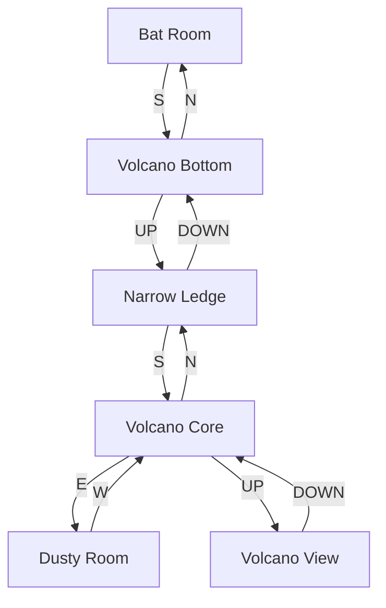

# Volcano Region

Volcanic caverns accessed from the Coal Mine's Bat Room. Features dangerous lava flows and two valuable gem treasures.

## Room Connections

## Rooms

| Room | File | Key Features |
|------|------|--------------|
| Volcano Bottom | [volcano-bottom.ts](./rooms/volcano-bottom.ts) | Entry, lava below |
| Narrow Ledge | [narrow-ledge.ts](./rooms/narrow-ledge.ts) | Dangerous path |
| Volcano Core | [volcano-core.ts](./rooms/volcano-core.ts) | Central hub |
| Dusty Room | [dusty-room.ts](./rooms/dusty-room.ts) | Contains emerald |
| Volcano View | [volcano-view.ts](./rooms/volcano-view.ts) | Summit, contains ruby |

## Objects

| Object | Location | Purpose |
|--------|----------|---------|
| Large emerald | Dusty Room | Treasure (5 points) |
| Moby ruby | Volcano View | Treasure (15 points) |

## Implementation Status

- [x] Room geometry and connections
- [x] Treasures (20 pts total)
- [x] Connection to Coal Mine
- [ ] Heat/lava damage mechanics
- [ ] Balloon vehicle (Zork II content?)
