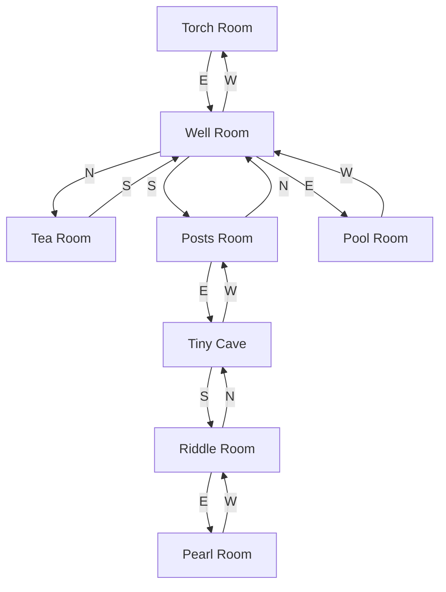
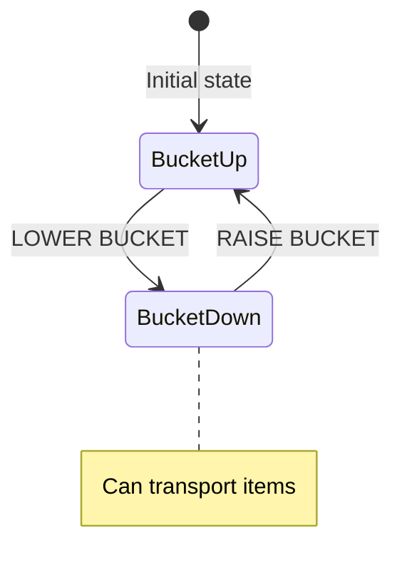

# Well Room Region

Underground area centered around a deep well. Accessed from the Temple region via the Torch Room.

## Room Connections

## Rooms

| Room | File | Key Features |
|------|------|--------------|
| Well Room | [well-room.ts](./rooms/well-room.ts) | Deep well, bucket mechanism |
| Tea Room | [tea-room.ts](./rooms/tea-room.ts) | Dusty table, faded paintings |
| Posts Room | [posts-room.ts](./rooms/posts-room.ts) | Wooden support posts |
| Pool Room | [pool-room.ts](./rooms/pool-room.ts) | Underground pool, silver chalice |
| Tiny Cave | [tiny-cave.ts](./rooms/tiny-cave.ts) | Cramped passage |
| Riddle Room | [riddle-room.ts](./rooms/riddle-room.ts) | Mysterious riddle inscription |
| Pearl Room | [pearl-room.ts](./rooms/pearl-room.ts) | Pearlescent grotto, pearl treasure |

## Objects

| Object | Location | Purpose |
|--------|----------|---------|
| Well | Well Room | Scenery, bucket mechanism |
| Bucket | Well Room | Container, can be lowered |
| Silver chalice | Pool Room | Treasure (10 points) |
| Pearl | Pearl Room | Treasure (15 points) |
| Riddle inscription | Riddle Room | Scenery, puzzle hint |
| Dusty table | Tea Room | Scenery |
| Wooden posts | Posts Room | Scenery |

## Key Puzzles

### 1. Well Bucket Mechanism

The bucket can be used to transport items up and down the well (mechanic not yet implemented).

## Original Dungeon Notes

In the original Mainframe Dungeon, the Well Room area was part of a larger underground complex. The well could be used with a bucket to transport items between levels.

## Implementation Status

- [x] Room geometry and connections
- [x] Basic objects placed
- [x] Treasure value assigned
- [ ] Bucket lower/raise mechanics
- [ ] Well bottom connection (if any)
