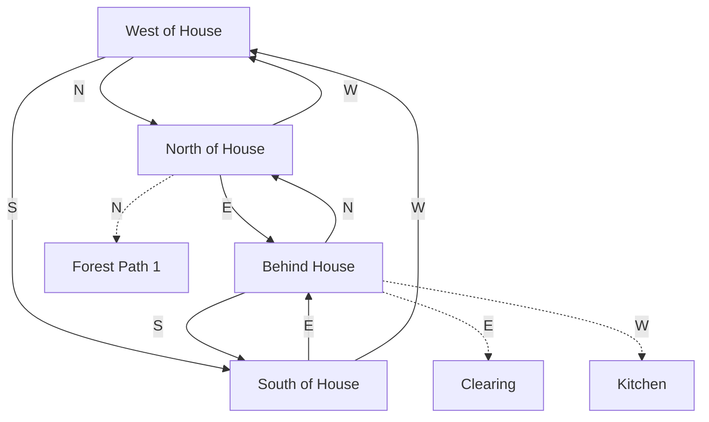
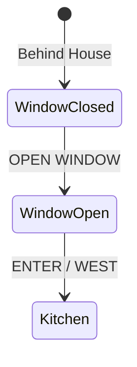

# White House Region

The starting area of Dungeo - four outdoor rooms surrounding the iconic white house. This region is based on the classic Zork opening.

## Room Connections

## Rooms

| Room | File | Key Features |
|------|------|--------------|
| West of House | [west-of-house.ts](./rooms/west-of-house.ts) | Starting location, mailbox |
| North of House | [north-of-house.ts](./rooms/north-of-house.ts) | Path to forest |
| South of House | [south-of-house.ts](./rooms/south-of-house.ts) | Clearing visible |
| Behind House | [behind-house.ts](./rooms/behind-house.ts) | Window entry to kitchen |

## Objects

| Object | Location | Purpose |
|--------|----------|---------|
| Small mailbox | West of House | Openable container, contains leaflet |
| Leaflet | Inside mailbox | Welcome message, readable |
| Front door | West of House | Scenery, boarded up |
| Window | Behind House | Openable, entry point to kitchen |
| White house | All rooms | Scenery (separate instance per room) |

## Key Puzzles

### 1. Opening the Mailbox

The classic first puzzle - open the mailbox, read the leaflet.

### 2. Entering the House

The front door is boarded up. The only way in is through the window behind the house.

## Original Zork Notes

In the original Zork/Dungeon, West of House was the iconic starting location. The mailbox and leaflet established the game's personality from the very first interaction. The house exterior forms a ring that players walk around to find the entry point.

## Implementation Status

- [x] Room geometry and connections
- [x] Basic objects placed
- [x] Mailbox opening/closing
- [x] Leaflet readable
- [x] Window to kitchen connection
- [ ] "OPEN DOOR" message about boarded door
